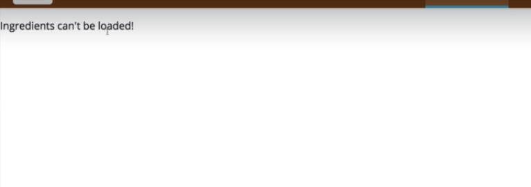

# S10 | Burger Builder Project - Accessing a Server
---

## S10 | Creating the Firebase Project
---
Its very easy to create a firebase project. Just go to the site and follow the steps.


### The Database Endpoint 
It looks like this : 
`https://burger-proto.firebaseio.com/`

## S10 | Creating the Axios Instance 
---
### Installing Axios in Burger Builder
`npm install --save axios`

### Code

* Creating Axios Instance - Axios-Orders

  `axios-orders.js`
  ```js 
  import axios from 'axios'

  const instance = axios.create({
    baseURL: 'https://burger-proto.firebaseio.com/'
  })

  export default instance;
  ```
  -`baseURL` - this is the **firebase endpoint** root url where data is posted.

## S10 | Sending a POST Request
---
### Objective 
1. We want to post data to the server when we click continue in the OrderSummary.
  

### Code 

`BurgerBuilder.js`
```js
+ import axios from '../../axios-orders'
continuePurchaseHandler = () => {
  // POST data to the server 
  const {ingredients, totalPrice:price} = this.state;
  // Dummy Order data
  const data = {
    ingredients: ingredients,
    price: price,
    customer: {
      name: 'Arif Mohammad',
      address: 'Uttara',
      contact: '01971842779'
    }
  }
+  axios.post('/orders.json',data)
+  .then(res => console.log(res))
+  .catch(error => console.log(error));
}
```
  - `/orders.json` - this will take into account the baseURL we have set in the axios instance and will post data to the `orders` node in firebase. Do not forget to add `.json`.
  - **data** - is the data to be posted.

### Output 
**Data has been posted to the firebase server orders node**


## S10 | Displaying a Spinner while Sending a Request
---
### Objective 
1. Show a Spinner while posting data to the server 
   
2. Close the modal when the data is save in the server and response is returned, whether success or failure.

### Code

* **Site used for the Spinner CSS**
[Site Link](https://projects.lukehaas.me/css-loaders/)

`Spinner.js`
```js
import React from 'react';
import classes from './Spinner.module.css'

const spinner = () => {
  return (
    <div className={classes.Loader}>...Loading</div>
  )
}

export default spinner;
```

`Spinner.module.css`
```css
.Loader {
  margin: 100px auto;
  font-size: 25px;
  width: 1em;
  height: 1em;
  border-radius: 50%;
  position: relative;
  text-indent: -9999em;
  -webkit-animation: load5 1.1s infinite ease;
  animation: load5 1.1s infinite ease;
  -webkit-transform: translateZ(0);
  -ms-transform: translateZ(0);
  transform: translateZ(0);
}
@-webkit-keyframes load5 {
  0%,
  100% {
    box-shadow: 0em -2.6em 0em 0em #ed8b43, 1.8em -1.8em 0 0em rgba(237,139,67, 0.2), 2.5em 0em 0 0em rgba(237,139,67, 0.2), 1.75em 1.75em 0 0em rgba(237,139,67, 0.2), 0em 2.5em 0 0em rgba(237,139,67, 0.2), -1.8em 1.8em 0 0em rgba(237,139,67, 0.2), -2.6em 0em 0 0em rgba(237,139,67, 0.5), -1.8em -1.8em 0 0em rgba(237,139,67, 0.7);
  }
  12.5% {
    box-shadow: 0em -2.6em 0em 0em rgba(237,139,67, 0.7), 1.8em -1.8em 0 0em #ed8b43, 2.5em 0em 0 0em rgba(237,139,67, 0.2), 1.75em 1.75em 0 0em rgba(237,139,67, 0.2), 0em 2.5em 0 0em rgba(237,139,67, 0.2), -1.8em 1.8em 0 0em rgba(237,139,67, 0.2), -2.6em 0em 0 0em rgba(237,139,67, 0.2), -1.8em -1.8em 0 0em rgba(237,139,67, 0.5);
  }
  25% {
    box-shadow: 0em -2.6em 0em 0em rgba(237,139,67, 0.5), 1.8em -1.8em 0 0em rgba(237,139,67, 0.7), 2.5em 0em 0 0em #ed8b43, 1.75em 1.75em 0 0em rgba(237,139,67, 0.2), 0em 2.5em 0 0em rgba(237,139,67, 0.2), -1.8em 1.8em 0 0em rgba(237,139,67, 0.2), -2.6em 0em 0 0em rgba(237,139,67, 0.2), -1.8em -1.8em 0 0em rgba(237,139,67, 0.2);
  }
  37.5% {
    box-shadow: 0em -2.6em 0em 0em rgba(237,139,67, 0.2), 1.8em -1.8em 0 0em rgba(237,139,67, 0.5), 2.5em 0em 0 0em rgba(237,139,67, 0.7), 1.75em 1.75em 0 0em #ed8b43, 0em 2.5em 0 0em rgba(237,139,67, 0.2), -1.8em 1.8em 0 0em rgba(237,139,67, 0.2), -2.6em 0em 0 0em rgba(237,139,67, 0.2), -1.8em -1.8em 0 0em rgba(237,139,67, 0.2);
  }
  50% {
    box-shadow: 0em -2.6em 0em 0em rgba(237,139,67, 0.2), 1.8em -1.8em 0 0em rgba(237,139,67, 0.2), 2.5em 0em 0 0em rgba(237,139,67, 0.5), 1.75em 1.75em 0 0em rgba(237,139,67, 0.7), 0em 2.5em 0 0em #ed8b43, -1.8em 1.8em 0 0em rgba(237,139,67, 0.2), -2.6em 0em 0 0em rgba(237,139,67, 0.2), -1.8em -1.8em 0 0em rgba(237,139,67, 0.2);
  }
  62.5% {
    box-shadow: 0em -2.6em 0em 0em rgba(237,139,67, 0.2), 1.8em -1.8em 0 0em rgba(237,139,67, 0.2), 2.5em 0em 0 0em rgba(237,139,67, 0.2), 1.75em 1.75em 0 0em rgba(237,139,67, 0.5), 0em 2.5em 0 0em rgba(237,139,67, 0.7), -1.8em 1.8em 0 0em #ed8b43, -2.6em 0em 0 0em rgba(237,139,67, 0.2), -1.8em -1.8em 0 0em rgba(237,139,67, 0.2);
  }
  75% {
    box-shadow: 0em -2.6em 0em 0em rgba(237,139,67, 0.2), 1.8em -1.8em 0 0em rgba(237,139,67, 0.2), 2.5em 0em 0 0em rgba(237,139,67, 0.2), 1.75em 1.75em 0 0em rgba(237,139,67, 0.2), 0em 2.5em 0 0em rgba(237,139,67, 0.5), -1.8em 1.8em 0 0em rgba(237,139,67, 0.7), -2.6em 0em 0 0em #ed8b43, -1.8em -1.8em 0 0em rgba(237,139,67, 0.2);
  }
  87.5% {
    box-shadow: 0em -2.6em 0em 0em rgba(237,139,67, 0.2), 1.8em -1.8em 0 0em rgba(237,139,67, 0.2), 2.5em 0em 0 0em rgba(237,139,67, 0.2), 1.75em 1.75em 0 0em rgba(237,139,67, 0.2), 0em 2.5em 0 0em rgba(237,139,67, 0.2), -1.8em 1.8em 0 0em rgba(237,139,67, 0.5), -2.6em 0em 0 0em rgba(237,139,67, 0.7), -1.8em -1.8em 0 0em #ed8b43;
  }
}
@keyframes load5 {
  0%,
  100% {
    box-shadow: 0em -2.6em 0em 0em #ed8b43, 1.8em -1.8em 0 0em rgba(237,139,67, 0.2), 2.5em 0em 0 0em rgba(237,139,67, 0.2), 1.75em 1.75em 0 0em rgba(237,139,67, 0.2), 0em 2.5em 0 0em rgba(237,139,67, 0.2), -1.8em 1.8em 0 0em rgba(237,139,67, 0.2), -2.6em 0em 0 0em rgba(237,139,67, 0.5), -1.8em -1.8em 0 0em rgba(237,139,67, 0.7);
  }
  12.5% {
    box-shadow: 0em -2.6em 0em 0em rgba(237,139,67, 0.7), 1.8em -1.8em 0 0em #ed8b43, 2.5em 0em 0 0em rgba(237,139,67, 0.2), 1.75em 1.75em 0 0em rgba(237,139,67, 0.2), 0em 2.5em 0 0em rgba(237,139,67, 0.2), -1.8em 1.8em 0 0em rgba(237,139,67, 0.2), -2.6em 0em 0 0em rgba(237,139,67, 0.2), -1.8em -1.8em 0 0em rgba(237,139,67, 0.5);
  }
  25% {
    box-shadow: 0em -2.6em 0em 0em rgba(237,139,67, 0.5), 1.8em -1.8em 0 0em rgba(237,139,67, 0.7), 2.5em 0em 0 0em #ed8b43, 1.75em 1.75em 0 0em rgba(237,139,67, 0.2), 0em 2.5em 0 0em rgba(237,139,67, 0.2), -1.8em 1.8em 0 0em rgba(237,139,67, 0.2), -2.6em 0em 0 0em rgba(237,139,67, 0.2), -1.8em -1.8em 0 0em rgba(237,139,67, 0.2);
  }
  37.5% {
    box-shadow: 0em -2.6em 0em 0em rgba(237,139,67, 0.2), 1.8em -1.8em 0 0em rgba(237,139,67, 0.5), 2.5em 0em 0 0em rgba(237,139,67, 0.7), 1.75em 1.75em 0 0em #ed8b43, 0em 2.5em 0 0em rgba(237,139,67, 0.2), -1.8em 1.8em 0 0em rgba(237,139,67, 0.2), -2.6em 0em 0 0em rgba(237,139,67, 0.2), -1.8em -1.8em 0 0em rgba(237,139,67, 0.2);
  }
  50% {
    box-shadow: 0em -2.6em 0em 0em rgba(237,139,67, 0.2), 1.8em -1.8em 0 0em rgba(237,139,67, 0.2), 2.5em 0em 0 0em rgba(237,139,67, 0.5), 1.75em 1.75em 0 0em rgba(237,139,67, 0.7), 0em 2.5em 0 0em #ed8b43, -1.8em 1.8em 0 0em rgba(237,139,67, 0.2), -2.6em 0em 0 0em rgba(237,139,67, 0.2), -1.8em -1.8em 0 0em rgba(237,139,67, 0.2);
  }
  62.5% {
    box-shadow: 0em -2.6em 0em 0em rgba(237,139,67, 0.2), 1.8em -1.8em 0 0em rgba(237,139,67, 0.2), 2.5em 0em 0 0em rgba(237,139,67, 0.2), 1.75em 1.75em 0 0em rgba(237,139,67, 0.5), 0em 2.5em 0 0em rgba(237,139,67, 0.7), -1.8em 1.8em 0 0em #ed8b43, -2.6em 0em 0 0em rgba(237,139,67, 0.2), -1.8em -1.8em 0 0em rgba(237,139,67, 0.2);
  }
  75% {
    box-shadow: 0em -2.6em 0em 0em rgba(237,139,67, 0.2), 1.8em -1.8em 0 0em rgba(237,139,67, 0.2), 2.5em 0em 0 0em rgba(237,139,67, 0.2), 1.75em 1.75em 0 0em rgba(237,139,67, 0.2), 0em 2.5em 0 0em rgba(237,139,67, 0.5), -1.8em 1.8em 0 0em rgba(237,139,67, 0.7), -2.6em 0em 0 0em #ed8b43, -1.8em -1.8em 0 0em rgba(237,139,67, 0.2);
  }
  87.5% {
    box-shadow: 0em -2.6em 0em 0em rgba(237,139,67, 0.2), 1.8em -1.8em 0 0em rgba(237,139,67, 0.2), 2.5em 0em 0 0em rgba(237,139,67, 0.2), 1.75em 1.75em 0 0em rgba(237,139,67, 0.2), 0em 2.5em 0 0em rgba(237,139,67, 0.2), -1.8em 1.8em 0 0em rgba(237,139,67, 0.5), -2.6em 0em 0 0em rgba(237,139,67, 0.7), -1.8em -1.8em 0 0em #ed8b43;
  }
}

```

`BurgerBuilder.js`
```js
//...
 state = {
    ingredients: {
      salad: 0,
      bacon: 0,
      cheese: 0,
      meat: 0
    },
    totalPrice: 4,
    isPurchasable: false,
    isPurchasing: false,
+   isLoading: false
  };
//...  
//...
continuePurchaseHandler = () => {
    // POST data to the server
+   this.setState({ isLoading: true });
    const { ingredients, totalPrice: price } = this.state;

    // Dummy Order data
    const data = {
      ingredients: ingredients,
      price: price,
      customer: {
        name: "Arif Mohammad",
        address: "Uttara",
        contact: "01971842779"
      }
    };
    axios
      .post("/orders.json", data)
      .then(res => {
+      this.setState({ isLoading: false, isPurchasing: false });
        console.log(res);
      })
      .catch(error => {
+     this.setState({ isLoading: false, isPurchasing: false });
        console.log(error);
      });
  };

  render() {
    let orderSummary = (
      <OrderSummary
        ingredients={ingredients}
        hideModal={this.hideModalHandler}
        continuePurchase={this.continuePurchaseHandler}
        totalPrice={totalPrice}
      />
    );
+   if (isLoading) orderSummary = <Spinner />;
    return (
      //...
    )

  }
```

## S10 | Handling Errors
---
### Objective
1. Showing a modal with Error Message globally. i.e in whichever component error occurs this modal will be shown. 
2. Create a reusable hicher order component (hoc) which we can wrap around any component (which uses axios) to handle its error.

### Lecture Snapshots
#### **Creating a Hoc (Higher Order Componen) to show error commonly (withErrorHandler).**
  

#### **Wrap the `BurgerBuilder` component with `withErrorHandler` hoc.**  
  
  
  

#### **We need information from the wrapped component to know when to show this error modal (withErrorHandler)**
  * We need to **pass the axios instance** which has this information i.e when an error is occuring while sending a request or receiving a response.
  * We will be modifying the hoc (withErrorHandler) to return anonymous class, thus **acting like a class factory**
  
  * We will define Life cycle hook **componentDidMount to set up the axios interceptor** where we will define what happens when error occurs.
  * Also we will define a state to interact dynamically when such error occurs. Remember state is for interactivity.
    
  * **Clear the error status when sending request each time**
     

#### **Show error only when error state is set as true**
  

#### **On Click of Modal Hide the Error Message**
  

#### **Show error only when error state is set as true**
   

#### **Pass axios as an argument to the withErrorHandler hoc** from the `BurgerBuilder` component.
  
  
  * We are importing here 
    

#### **Return the request and response, otherwise you will be blocking the request and also the response.** 
   

#### **Create a scenario for error in the request.**
  
  
  * You should get a network error
  

### Code

`withErrorHandler.js`
```js
import React from "react";
import Modal from "../../components/UI/Modal/Modal";

const withErrorHandler = (WrappedComponent, axios) => {
  // return props => {
  //   return (
  //     <React.Fragment>
  //       <Modal show>Something didn't work!</Modal>
  //       <WrappedComponent {...props} />
  //     </React.Fragment>
  //   );
  // };  
  return class extends React.Component {
    state = {
      error: null
    }
    handleErrorConfirmed = () => {
      this.setState({error: null})
    }
    componentDidMount () {
      axios.interceptors.request.use(req => {
        this.setState({error: null})
        return req; // you need to return otherwise request is blocked.
      })      
      axios.interceptors.response.use(null, error => {
        console.log(error.message)
        this.setState({error: error})
      });      
    }
    render() {
      const {error} = this.state; 
      return (
        <React.Fragment>
          <Modal 
            show={error}
            hideModal={this.handleErrorConfirmed}>
            {error ? error.message : null}
          </Modal>
          <WrappedComponent {...this.props} />
        </React.Fragment>
      );
    }
  };
};

export default withErrorHandler;

```
`BurgerBuilder.js` - updated function
```js
//...
import axios from "../../axios-orders";
import Spinner from "../../components/UI/Spinner/Spinner";
import withErrorHandler from '../../hoc/withErrorHandler/withErrorHandler'

//...
continuePurchaseHandler = () => {
    // POST data to the server
    this.setState({ isLoading: true });
    const { ingredients, totalPrice: price } = this.state;
    // Dummy Order data
    const data = {
      ingredients: ingredients,
      price: price,
      customer: {
        name: "Arif Mohammad",
        address: "Uttara",
        contact: "01971842779"
      }
    };
    axios
      .post("/orders.json", data)
      .then(res => {
        this.setState({ isLoading: false, isPurchasing: false });
        console.log(res);
      })
      .catch(error => {
        this.setState({ isLoading: false, isPurchasing: false });
        console.log(error);
      });
  };
//...
  let orderSummary = (
      <OrderSummary
        ingredients={ingredients}
        hideModal={this.hideModalHandler}
        continuePurchase={this.continuePurchaseHandler}
        totalPrice={totalPrice}
      />
    );

```

`axios.js` - (refresh memory)
```js
import axios from 'axios'

const instance = axios.create({
  baseURL: 'https://burger-proto.firebaseio.com/'
})

export default instance;
```

## S10 | Retrieving Data from the Backend
---
### Objective
1. Get the ingredients from the backend
  
### Lecture Snapshots
#### Initialise ingredients in the Firebase server


#### Fetch ingredients data and set the state of the `BurgerBuilder` component dynamically 
Set ingredients to null and set it in the `componentDidMount()` life cycle hook

Application throws error as initially ingredients is **null**


#### Check first if ingredients exists before rendering anything that depends on ingredients like the burger.
Burger is a Spinner by default 

And its only this if ingredients have been loaded
 
 
Order Summary also uses the ingredients and therefore fail.
  
So we need to do the same check for `OrderSummary`

#### But Why are we not getting the error modal we defined in last lecture when we remove the .json from the axios call to ingredients node ??
Remove the .json
  
We do not get the error modal 
  
**Try to find the reason yourself !**
...
...
**Lets debug this together!**

`componentDidMount` in the `withErrorHandler` component is only called when all child components have been rendered.

Which means after `componentDidMount` was completed in the child components, here its the `WrappedComponent`.

Since we reach out to the server to get the ingredients  in the `componentDidMount` of the `WrappedComponent` **We Never Setup Our Interceptors** as error occurs here. 

 

We need to setup the interceptors before the child component `renders()` or before the `componentDidMount` of the child components gets executed.

**There are 2 ways to do this:**
1. componentWillMount() - this is deprecated. But you can setup the interceptor in the `componentWillMount()` of `withErrorHandler`
2. constructor() - this is the best solution to setup the incerceptors here. Since the `constructor()` of `withErrorHandler` will always be executed when it gets created.

  

**But we get another error! That we fail to set our state.**

 

This happens because the `then` block in our burger builder gets executed even though we have an error.

We need to define a catch block in the WrappedComponent.
 
Now the Network error modal is seen.
 
But this can be dismissed and our application will be broken.

#### Setup a UI to handle the error. So that the user sees a Error Page when error occurs.

Inside the `BurgerBuilder` component set up `error` state and dynamically change this when encountering an error while rewteiving data.
 
 
 
 

### Code
`withErrorHandler.js`
```js
import React from "react";
import Modal from "../../components/UI/Modal/Modal";

const withErrorHandler = (WrappedComponent, axios) => {
  // return props => {
  //   return (
  //     <React.Fragment>
  //       <Modal show>Something didn't work!</Modal>
  //       <WrappedComponent {...props} />
  //     </React.Fragment>
  //   );
  // };  
  return class extends React.Component {
+  constructor() {
      super()
      axios.interceptors.request.use(req => {
        this.setState({error: null})
        return req; // you need to return otherwise request is blocked.
      })      
      axios.interceptors.response.use(null, error => {
        console.log(error.message)
        this.setState({error: error})
        // return Promise.reject(error); // to pass this exact error to the WrapperComponent so that it can handle the error locally.
      }); 
+  }
    state = {
      error: null
    }
    handleErrorConfirmed = () => {
      this.setState({error: null})
    }
-    // componentDidMount () {
    //   console.log("withError");
    //   axios.interceptors.request.use(req => {
    //     this.setState({error: null})
    //     return req; // you need to return otherwise request is blocked.
    //   })      
    //   axios.interceptors.response.use(null, error => {
    //     console.log(error.message)
    //     this.setState({error: error})
    //   });      
-    // }
    render() {
      const {error} = this.state; 
      return (
        <React.Fragment>
          <Modal 
            show={error}
            hideModal={this.handleErrorConfirmed}>
            {error ? error.message : null}
          </Modal>
          <WrappedComponent {...this.props} />
        </React.Fragment>
      );
    }
  };
};

export default withErrorHandler;

```

`BurgerBuilder.js` 
```js
//...
  state = {
    // ingredients: {
    //   salad: 0,
    //   bacon: 0,
    //   cheese: 0,
    //   meat: 0
    // },
    ingredients: null,
    totalPrice: 4,
    isPurchasable: false,
    isPurchasing: false,
    isLoading: false,
+   error: false
  };
//...
+ componentDidMount() {
    // Get ingredients from the server
    axios.get("/ingredients.json")
    .then(res => {
      console.log(res.data);
      this.setState({ ingredients: res.data });
    })
    .catch(error => { 
      console.log(error, '=>WrappedComponent');
+      this.setState({error: true});
    });
+  }

//...
+ renderBurger() {
    const { ingredients, totalPrice, isPurchasable, error } = this.state; //destructuring

    if (ingredients) {
      const disabledInfo = this.getDisabledInfo(ingredients); // {salad: false, bacon: true ...}
      return (
        <React.Fragment>
          <Burger ingredients={ingredients} />
          <BuildControls
            addIngredient={this.addIngredientHandler}
            removeIngredient={this.removeIngredientHandler}
            disabledInfo={disabledInfo}
            totalPrice={totalPrice}
            hasNoIngredients={!isPurchasable}
            placeOrder={this.placeOrderHandler}
          />
        </React.Fragment>
      );
    }else if(error) {
      return (
        <p>Ingredients cannot be loaded!</p>
      )
    }
    return <Spinner />;
+ }
+ renderOrderSummary() {
    const { ingredients, totalPrice, isLoading } = this.state; //destructuring
    if (isLoading) {
      return <Spinner />;
    } else if (ingredients) {
      return (
        <OrderSummary
          ingredients={ingredients}
          hideModal={this.hideModalHandler}
          continuePurchase={this.continuePurchaseHandler}
          totalPrice={totalPrice}
        />
      );      
    }else return null;
+  }
  render() {
+   const { isPurchasing } = this.state; //destructuring
+   const burger = this.renderBurger();
+   const orderSummary = this.renderOrderSummary();
    return (
      <Aux>
        <Modal show={isPurchasing} hideModal={this.hideModalHandler}>
+         {orderSummary}
        </Modal>
+       {burger}
      </Aux>
    );
  }
0
```

## S10 | Removing Old Interceptors
### Objective 

1. **Whenever we dont need the `BurgerBuilder` or any `Component` wrapped by `withErrorHandler`, we will make sure that we remove the interceptor created while mouting the component.**

2. **So that interceptors do not pile up when we re-use hoc like the withErrorHandler with any other components by wrapping with it.** 

3. **Otherwise, it might give rise to errors, memory leak, etc while we implement Routing in React**

### Lecture Snapshots

* Get the interceptor reference

 

* Remove unused interceptor

    

* Code to test whether it works. Delete the code below after test is successful.

    

    

    

    

* Test 

    


### Code
```js
const withErrorHandler = (WrappedComponent, axios) => {
  // return props => {
  //   return (
  //     <React.Fragment>
  //       <Modal show>Something didn't work!</Modal>
  //       <WrappedComponent {...props} />
  //     </React.Fragment>
  //   );
  // };  
  return class extends React.Component {
    constructor() {
      super()
+     this.reqInterceptor = axios.interceptors.request.use(req => {
        this.setState({error: null})
        return req; // you need to return otherwise request is blocked.
      })      
+     this.resInterceptor = axios.interceptors.response.use(null, error => {
        console.log(error.message)
        this.setState({error: error})
        // return Promise.reject(error); // to pass this exact error to the WrapperComponent so that it can handle the error locally.
      }); 
    }
    componentWillUnmount() {
      axios.interceptors.eject(this.reqInterceptor);
      axios.interceptors.eject(this.resInterceptor);
    }
    //...
  }
}
```
