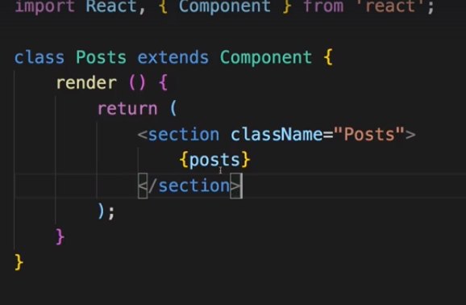
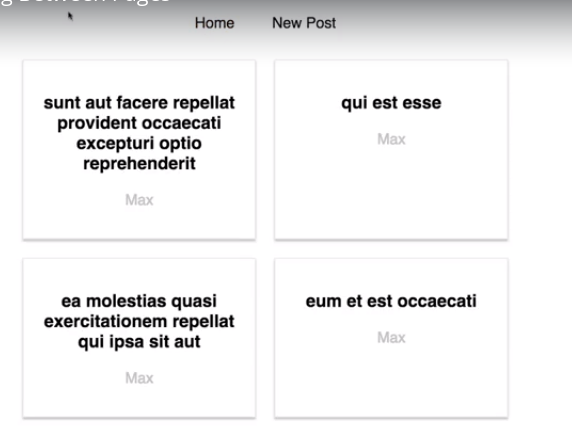
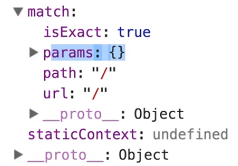
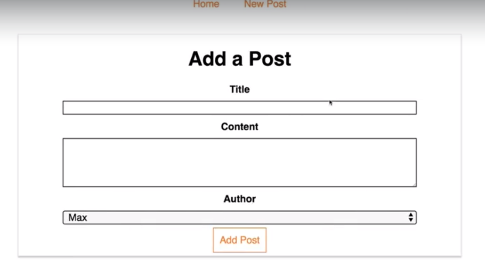
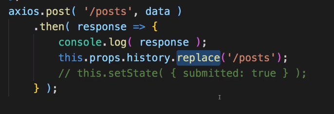
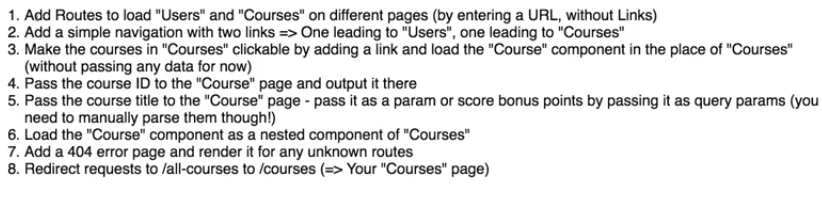
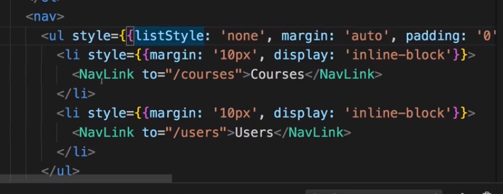
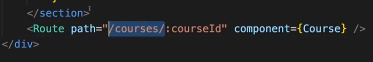

# S11 | Routing
## Objective 
1. We will go through the section without coding - to save time
2. We will take snapshots as we see the lectures
3. We will code in the Burger Builder Project

## S11 | Routing and SPAs
---

## S11 | Setting up Links
---
### Objective
1. Setup links for different pages in the demo-post application below:

#### Lecture Snapshots

## S11 | Setting up the Router Package
---
### Lecture Snapshots

We will use routing in the blog component
 
   
 

Enable Routing
 

This is the Router now.
 

We will use routing in the blog component
 

## S11 | Preparing the Project for Routing
---

## S11 | Setting Up and Rendering Routes
---
### Lecture snapshots

The React Router to determine which path you are on, sees if you current path starts with this path, so if this is a **prefix**. You can override this behaviour using `exact` to match exactly the **whole path string**.

Multiple Routes for same path ? 

Output

## S11 | Rendering Components For Routes
---
Comment out

Using Component property

## S11 | Switching Between Pages
---
### Lecture snapshots 

### Issue
1. But our application reloads each time we click the links
2. This causes the aplication state to be lost
3. We want to avoid this state loss and let react load only the Route component while staying on the single page without reloading.

## S11 | Using Links To Switch Pages
---
### Objective 
1. We want to stay inside of the application when clicking links inside of it.

### Lecture snapshots

This lets react render only parts of the DOM Depending on the Route path and not re-load the entire application while navigating.

## S11 | Using Routing-Related Props
---
### Objective
1. Get Introduced to the default props passed by the React Router
2. We can use these props to extract query params, move to a hash fragment, etc.
   
### Lecture snapshots
Lets see the props in the `Posts` Component

These porps were passed by React Router automatically. 

Lets see the props in the `NewPost` Component

Later we will see how we can use the histroy object to use a method it provides us.

## S11 | The `withRouter` HOC & Route Props
---
### Objective
1. Find out what gets passed as props of a Component which gets loaded as part of another component. Like `Post` gets loaded as a part of `Posts` which gets loaded in the `Blog`component as a `Route`.

### Lecture snapshots
Lets see the props in the `Post` Component

We dont see the default props passed by React Router

But we see it in the `Posts` Component which gets loaded as a Route in the `Blog` component

So the Routing related props are not passed the component tree.
But there are two ways to get access to the Route props from inside a component rendered from a Route Component..

We can get access to the props passed by React Router in a Child (`Post`) Component in 2 ways : 
1. We can just pass them on using the spread operator

2. Using a Higher Order Component on the `Post` (child) Component

The withRouter hoc can be used to wrap any component where you expect to get the Router props from the nearest loaded Route

## S11 | Absolute Vs Relative Paths
---
### Objective
 
### Lecture snapshots
* **Absolute path** - The `newpost` will always be appended to the root domain `example.com`. So the path will be `example.com/new-post`. 

* Even if initially you were in a route with url `example.com/posts` this will not turn into a **Relative Path** i.e `example.com/posts/new-post` (appending to the end of the current path)

  

* **Relative Path** - What if you wanted to append at the end of your current path ?
  * You have to build the path **dynamically** by taking into advantage the fact that that you know your **current path**

  
  
  
  

## S11 | Styling The Active Route 
---
### Objective
1. Add custom css to the active React Links
2. This does not happen automatically. 

### How ?
1. We have to manually tell React Router that we want to apply custom css on the anchor tags it creates.
2. We need to use `NavLink` component instead of the `Link` component to attach a class when the link is active

### Lecture snapshots
Before

Import `NavLink`

Use NavLink, not Link

**active** class is attached now. This css class was not present before when using `Link` component

Now we can apply some styling

But now both link Home and NewPost are orange. But if we click on Home, only Home is orange. Why is that?
 
Because by default React Router treats these paths as prefixes.

Same is true for links. When checking whether a link is active or not it treats this as a prefix.
 
We have to add exact to let React Router know that the full path should be this, for this to be the active link.
Its needed only for the 1st link not the 2nd since there is no nesting for that.
 
Sometime you might not want `active` to be the active className. 
 
You can override the class that should be appended. Use the prop `activeClassName`.
 
 
activeStyle
 

## S11 | Passing Route Parameters
---
### Objective
1. Click on a single post and load that.
2. Pass the postid on click and load the appropriate post

### Lecture Snapshots

Passing the postID on click
 

We cannot have something like this `/1`, `/2` as different Routes for different posts since we dont know how many possible values are there.
 

We need to setup the route dynamically since each post has different postID. We will use the syntax `/:id` as a dynamic/flexible Route which says to the React Router that we have something dynamic, **a route parameter**, after the `/` 
 

We need to pass the paramter when clicking on a Route. **2 ways to do that** : 

1. **Wrap the `Post` component with a `Link` component and have the `to` prop refer to a dynamic route url.**

     
     

    Now we need to make sure that we load the `FullPost` component when going to this Route below:
     
      
     
    
    Error
     
     

    When you click a post, there is ID in the url like `http://localhost:3000/1`.
     

    But we see "Please select a Post" and not the relevant Post because the `this.prop.id` in the `FullPost` component is not set anymore. We are not retrieving the postID parameter set in the Route `/1`,`/2`.
     

    Whats working so far is : 
      1. We can click different post and load urls with different IDs
      2. We are also loading the FullPost component
      3. **But we now have to extract the Route paramter from the url to load the correct FullPost.**
      

## S11 | Extracting Route Parameters
---
### Objective
1. Extract the Route parameters

### Lecture Snapshots
Till now, we have set up the link and we set the `to` property where we passed the `postID`

We are able to recieve the postID since we have set up a flexible path here.

Now we need to retrieve that parameter too. In the `FullPost` component the this.props.id does not work as expected.

Lets check the `props` object passed to the FullPost component when clicking a `Post`. Note the `params.id = 3`

Its called `id` because that is the name we set up here.

Lets get the id in `FullPost`...

**Success**...We have loaded the relevant FullPost by passing the postID property using `this.props.match.params.id`

### Issue
1. If we click on `NewPost` we load the NewPost form but we also load the single post.

**Do you know why this happens ??**

# S11 | Parsing Query Parameters & the Fragment
---

# S11 | Using Switch to Load a Single Route
---
## Objective
1. Solve the issue below :

### Issue
1. If we click on `NewPost` we load the NewPost form but we also load the single post.

## Lecture Snapshots
All routes are rendered if they match the path

**One Solution** - could be ...

But you cannot change the urls like above ... ?

**Second Solution** - could be to load one Route at a time using `Switch` component. This will only load the first Route that matches the path.

The order is important when using `Switch`. Now `/new-post` should not come after `/:id`.

# S11 | Navigating Programmatically
---
## Objective
1. See an alternative to using `Link` component to load a single post - Navigate programatically

## Lecture Snapshots

Navigate programatically - suppose you want to navigate after some http request or any other operation. You can use the history object and navigate programatically after the operation ends.

`push` method allows you to push a page on the top of the stack of pages because navigation is basically just a stack of pages.

# S11 | Additional Information Regarding Active Links
---
## Objective
1. Concept - sometimes due to the way `to` property is defined will make it hard for the active link styling to occur as expected. 

## Lecture Snapshots

In this case the root page link "Posts" will be active at first. But after cliking a single post the **Posts** link wont be active.

Can you recall why? 

# S11 | Understanding Nested Routes
---
## Objective
1. So far we have loaded individual Routes in a Component that was not loaded via Routing.
2. No we want to load a Route with a component loaded via Routing i.e nested Routing.  

## Lecture Snapshots
Before the `FullPost` Route was in the `Blog` Component

But now we want to load a single `FullPost` component inside the `Posts` component which is itself loaded via Routing

Import Route and FullPost

Use nested Route. You can use the Route component wherever you want in your application as long as the Component inside which you are using it is wrapped by the `BrowserRouter` component.

Clicking on a single post, the url updates but the single post is not loaded.

The reason is that now we have created a nested Route.
Single post will get loaded when the path is like ` path="/:id" ` which does not match with the Route path for which its parent Component (`Post`) loads i.e. `path = "/" exact`

We can solve this by removing exact and changing the order in the Switch. 
Thus not both the nested Route and its parent Route will match.

Now it works !

### Issue 
Suppose we have as 

Thus we need to change the link from where we navigate.

Before

Now

Before 

Now
 

Before

Now

Before

Now - we have to update this Route path

**But this is cumbersome. Can we get the current path dynamically? Yes!**

Now we have same behaviour but nested routing where the path is changed dynamically.

# S11 | Creating Dynamic Nested Routes
---
## Issue
When we click on different posts it does not load the clicked post(a new component) on each click. Although the url changes to reflect that the click is working.

Whats the problem ? 

## Objective
1. Solve the Issue above.

## Lecture Snapshots
React Router behind the scenes does not replace the component all the time.
In case you are loading a component in whihc you are already on  like we are here. 

In such a case it wont execute the `componentDidMount` hook again because the component is not mounting, its just updating.

Solution is to implement `componentDidUpdate` and a utility method `loadData` which gets called in both hooks : `didMount` and `didUpdate`:

But now the request is sent infinite times. Why ? 

The condition inside `loadData()` is not correct.
We are checking if our id changed in the `props.id` which is never set.
We need to check the Router props forwarded.

We have to update this everywhere where we refer `props.id`

etc...

How to convert a string to a number ? (shortcut)

by adding a `+` sign in front.

**Now its fixed ! Great !!**

# S11 |  Redirecting Requests
---
## Objective
1. Redirect the user when they enter a url.

## Lecture Snapshots

**Solution-1** - render same Component for different paths

**Solution-2** - the `Redirect` component.

If you use outside the Switch statement `from` cannot be specified.

# S11 | Conditional Redirects
---
## Objective
Redirect conditionally after some http reques 

## Lecture Snapshots
Submitted state property

Set it to true once the http post request is made.

Conditionally redirect..

Result is we get redirected once we submit a new post...
 **==>** 

# S11 | Using the History Prop to Redirect (Replace)
---
## Objective
Instead of the changing routes conditionally we can use the history props to push a new page after some operation finished.

## Lecture Snapshots
Using the history prop to push new page. So the back button takes us back to the last visted page.

 

Redirect replaces the current page and does as below...

# S11 |  Working with Guards
---
## Objective
We want to guard some of our Routes so that only authenticated user can access those.

## Lecture Snapshots
Suppose we want to make sure that `NewPost` cannot be reached...

We can simply render this conditionally...

The last case in the Switch kicks in and redirects when no matching Route is found.

This is a guard.

Another alternative is to give the logic inside the Component we want to guard.

# S11 |  Handling the 404 Case (Unknown Routes)
---
## Objective
Render some dummy content for unknown Routes.

## Lecture Snapshots
Use the Route without using the `path` property.

It wont work together with the root path

# S11 | Loading Routes Lazily (Optional)
---
## Objective
We want to load the code of a **Route** on demand when we really need it.
Advanced feature used in bigger apps.

## Lecture Snapshots

Loading NewPost upfront might not be required.

Code Splitting

We want to load the NewPost component dynamically 

Old way of importing

The Async function requirese an argument 

Dynamically import Newpost only when the `AsyncNewPost` gets rendered on the screen.

Using the hoc

See the 1 chunk bundle for NewPost loaded when NewPost was clicked.

# S11 | Lazy Loading with React Suspense (16.6)
---
## Objective
Using React.lazy and Suspense to do code splitting and lazy loading of Component code bundles on demand. 

## Lecture Snapshots
We want to load these paths only when we need them

Lets modify the render() method...
Using `Suspense` component.

We can also use the Suspense component in conditional rendering...

This only works for client side rendered application, not a server side rendered app.
Also use this technique for bigger chunks of code.

# S11 | Routing and Server Deployment
--- 
## Objective

## Lecture Snapshots
The server should always return the index.html page even for unknown requests. This then allows the React application to take over which knows the Routes. 

We need to set the base path for application root urls as below, which is a sub-directory.

**How?**
The default setting is as below: 

# S11 | Assignment 
---
## Question

## Answer
1. Add Routes

2. Add Navigation 

Style the link differently

3. Make the Courses clickable and load the Course component in the place of courses. 
- push page manually through code
- using the Link component

Load the Course `Component`

 

4. Pass the courseID to the Course page and outpuut it there.

Output CourseID
s

5. Pass the title 

Pass 2 params

Use query params

Parse the query param...
parsing has to be done in the Course.js file

6. Load the Course component as a nested component.
# 22 min 

Course loaded beneath our courses

But it does not really update the title even though the title updates in the url.
Reason is we parse the title in componentDidMount but the component is not unmounted and remounted 

Infinite loop world..

7. Add a 404 error page 

Catch All Route

8. Redirect
