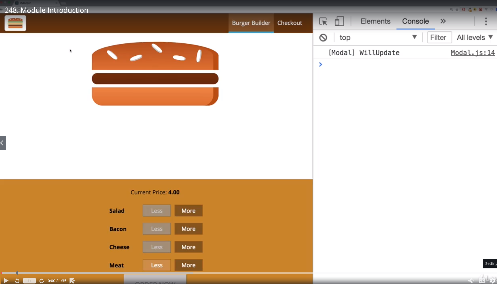
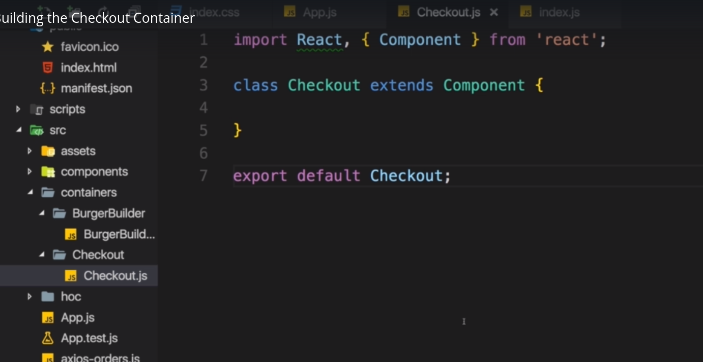
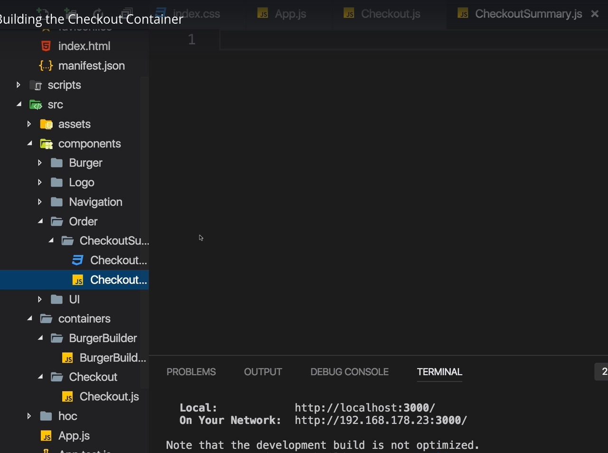
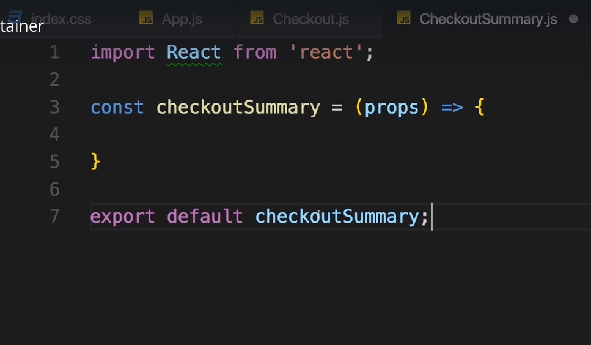

# S12 | Module Introdution
---
text
`file`

- We will add a checkout page

# S12 | Building the Checkout Container
---
## Container - Checkout
`containers/Checkout.js`

- we can also use functional component with hooks

## Checkout Summary 
Adding a CheckoutSummary component
`components/Order/CheckoutSummary.js`

Goal is to show a preview of the burger
`components/Order/CheckoutSummary.js`

