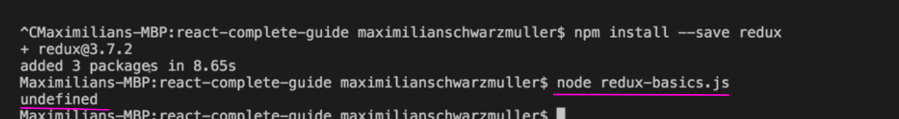
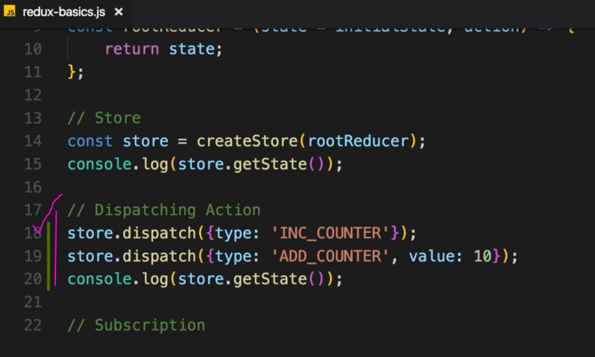
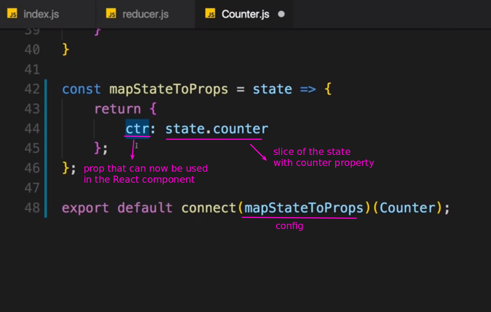
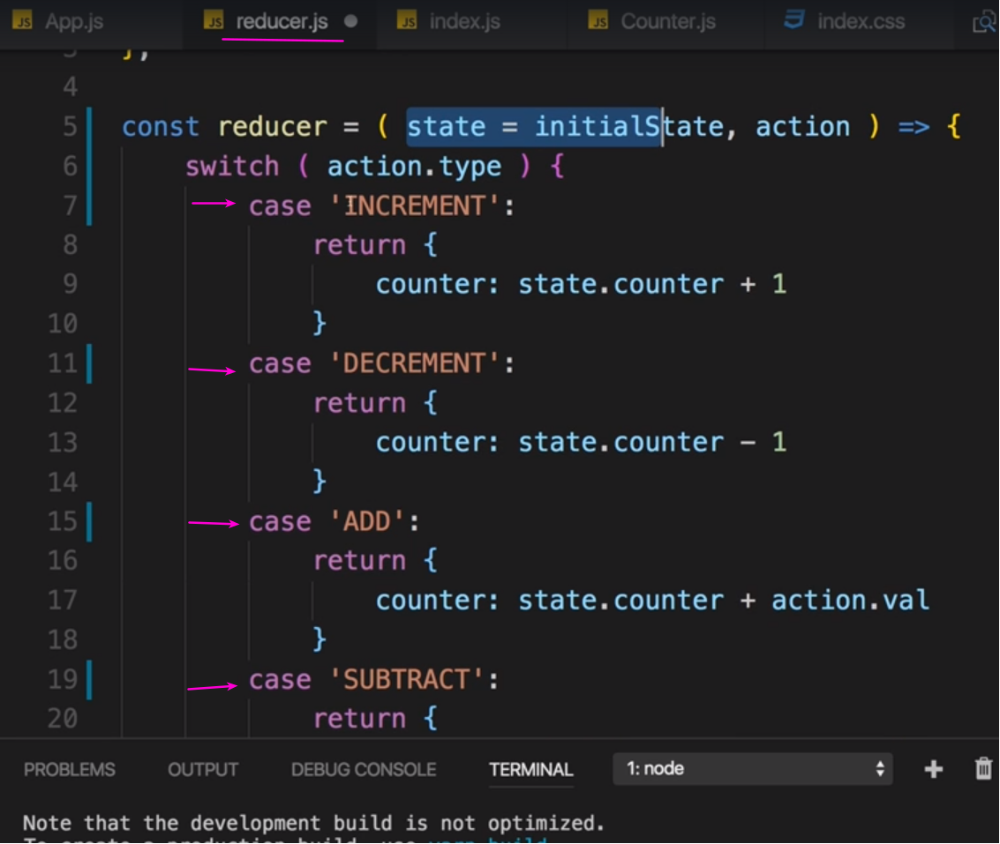
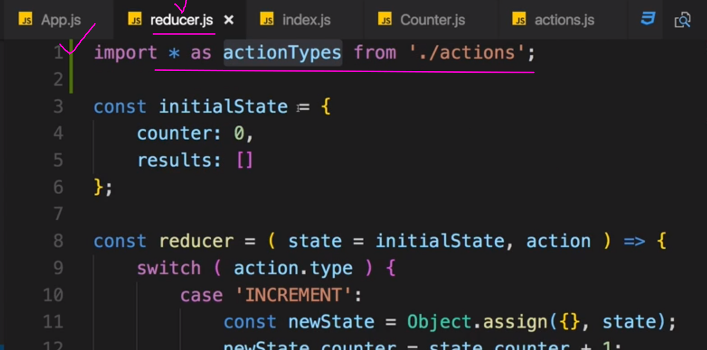
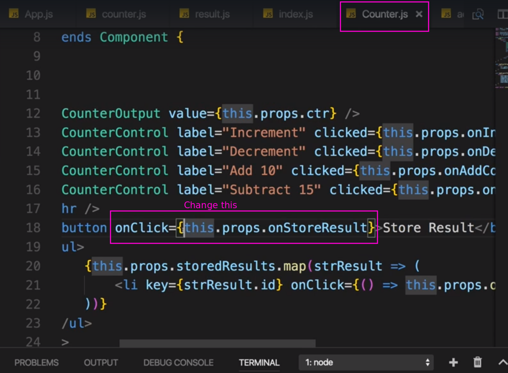
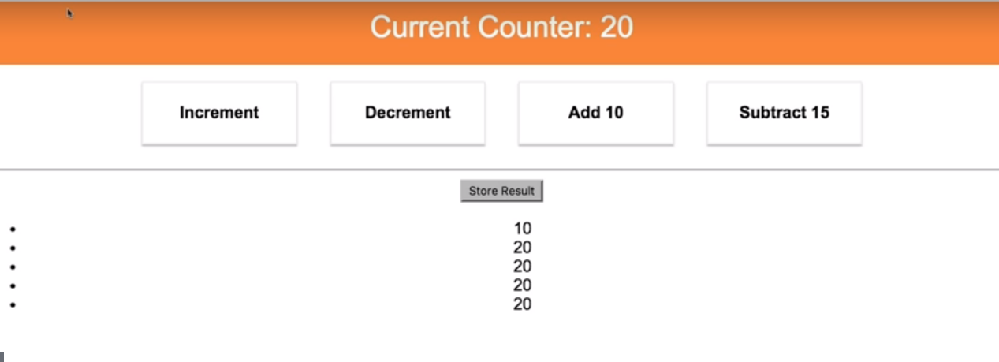
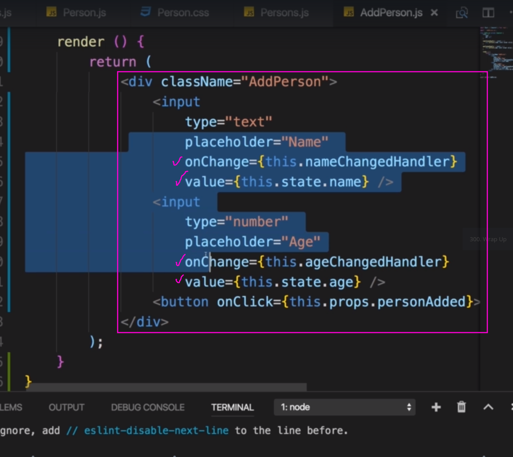

# S14 | Module Introdution
---


# S14 | Understanding State
---


# S14 | The Complexity of Managing State
---


# S14 | Understanding the Redux Flow
---


# S14 | Setting Up Reducer and Store
---





# S14 | Dispatching Actions
---



# S14 | Adding Subscriptions
---


# S14 | Connecting React to Redux
---


# S14 | Connecting the Store to React
---


But how do the React components subscribe to the state changes in the redux store ? 
We wont do this manually using store.subscribe but by using a higher order component provided by package `react-redux` -i.e- `connect`





# S14 | Dispatching Actions from within the Component
---


# S14 | Passing and Retrieving Data with Action
---


  
# S14 | Switch-Case in the Reducer
---


# S14 | Updating State Immutably
---


# S14 | Updating Arrays Immutably
---


# S14 | Immutable Update Patterns
---

## Immutable Update Patterns on reduxjs.org: http://redux.js.org/docs/recipes/reducers/ImmutableUpdatePatterns.html

#### Updating Nested Objects
The key to updating nested data is that every level of nesting must be copied and updated appropriately. This is often a difficult concept for those learning Redux, and there are some specific problems that frequently occur when trying to update nested objects. These lead to accidental direct mutation, and should be avoided.

#### Common Mistake #1: New variables that point to the same objects
Defining a new variable does not create a new actual object - it only creates another reference to the same object. An example of this error would be:
```js
function updateNestedState(state, action) {
    let nestedState = state.nestedState;
    // ERROR: this directly modifies the existing object reference - don't do this!
    nestedState.nestedField = action.data;
 
    return {
        ...state,
        nestedState
    };
}
```
This function does correctly return a shallow copy of the top-level state object, but because the nestedState variable was still pointing at the existing object, the state was directly mutated.

#### Common Mistake #2: Only making a shallow copy of one level
Another common version of this error looks like this:
```js
function updateNestedState(state, action) {
    // Problem: this only does a shallow copy!
    let newState = {...state};
 
    // ERROR: nestedState is still the same object!
    newState.nestedState.nestedField = action.data;
 
    return newState;
}
```
Doing a shallow copy of the top level is not sufficient - the nestedState object should be copied as well.

#### Correct Approach: Copying All Levels of Nested Data
**Unfortunately**, the process of correctly applying immutable updates to deeply nested state can easily become verbose and hard to read. Here's what an example of updating state.first.second[someId].fourth might look like:
```js
function updateVeryNestedField(state, action) {
    return {
        ...state,
        first : {
            ...state.first,
            second : {
                ...state.first.second,
                [action.someId] : {
                    ...state.first.second[action.someId],
                    fourth : action.someValue
                }
            }
        }
    }
}
```
Obviously, each layer of nesting makes this harder to read, and gives more chances to make mistakes. This is one of several reasons why you are encouraged to keep your state flattened, and compose reducers as much as possible.

#### Inserting and Removing Items in Arrays
Normally, a Javascript array's contents are modified using mutative functions like push, unshift, and splice. Since we don't want to mutate state directly in reducers, those should normally be avoided. Because of that, you might see "insert" or "remove" behavior written like this:

```js
function insertItem(array, action) {
    return [
        ...array.slice(0, action.index),
        action.item,
        ...array.slice(action.index)
    ]
}
 
function removeItem(array, action) {
    return [
        ...array.slice(0, action.index),
        ...array.slice(action.index + 1)
    ];
}
```
However, remember that the key is that the original in-memory reference is not modified. As long as we make a copy first, we can safely mutate the copy. Note that this is true for both arrays and objects, but nested values still must be updated using the same rules.

This means that we could also write the insert and remove functions like this:

```js
function insertItem(array, action) {
    let newArray = array.slice();
    newArray.splice(action.index, 0, action.item);
    return newArray;
}
 
function removeItem(array, action) {
    let newArray = array.slice();
    newArray.splice(action.index, 1);
    return newArray;
}
```
The remove function could also be implemented as:
```js
function removeItem(array, action) {
    return array.filter( (item, index) => index !== action.index);
}
```

#### Updating an Item in an Array
Updating one item in an array can be accomplished by using Array.map, returning a new value for the item we want to update, and returning the existing values for all other items:

function updateObjectInArray(array, action) {
    return array.map( (item, index) => {
        if(index !== action.index) {
            // This isn't the item we care about - keep it as-is
            return item;
        }
 
        // Otherwise, this is the one we want - return an updated value
        return {
            ...item,
            ...action.item
        };    
    });
}

#### Immutable Update Utility Libraries
Because writing immutable update code can become tedious, there are a number of utility libraries that try to abstract out the process. These libraries vary in APIs and usage, but all try to provide a shorter and more succinct way of writing these updates. Some, like dot-prop-immutable, take string paths for commands:

```js
state = dotProp.set(state, `todos.${index}.complete`, true)
```
Others, like immutability-helper (a fork of the now-deprecated React Immutability Helpers addon), use nested values and helper functions:
```js
var collection = [1, 2, {a: [12, 17, 15]}];
var newCollection = update(collection, {2: {a: {$splice: [[1, 1, 13, 14]]}}});
```
They can provide a useful alternative to writing manual immutable update logic.

Immutable Data#Immutable Update Utilities section of the Redux Addons Catalog.


# S14 | Outsourcing Action Types
---




# S14 | Combining Multiple Reducers
---


We will have one state in the end but to avoid naming conflicts, redux adds one level of nesting where it has one state object but basically with these keys here (`ctr, res`), in combined reducers as properties which give us access to these sub-states for these feature areas.







# S14 | Understanding State Types
---


# S14 | Assignment-5
---
Solved 

# S14 |  Combining Local UI State and Redux
---





# S14 | Wrap Up
---
You learned how redux works in general, that you work with reducers and actions, that you connect your react

containers to redux to that store you created, that single store you have, this one, that you can split

up your reducers into multiple reducers with combined reducers as I showed you

and that you should always manipulate your data immutably, never directly mutate a store.

You also see that we still work with container and presentational components,

we have the containers here which are connected to redux where we get the state as props or the dispatch

actions as props and that we then can still distribute our data down to other components.

So this pattern hasn't changed but of course we can create as many containers as we need in the application

to connect them to our state and get the relevant slices of the state in each of our containers to then

distribute it across all presentational components this container knows. This is redux in its core,


# S14 |  Useful Resources & Links
---
Redux Docs: http://redux.js.org/
Core Concepts: http://redux.js.org/docs/introduction/CoreConcepts.html
Actions: http://redux.js.org/docs/basics/Actions.html
Reducers: http://redux.js.org/docs/basics/Reducers.html
Redux FAQs: http://redux.js.org/docs/FAQ.html