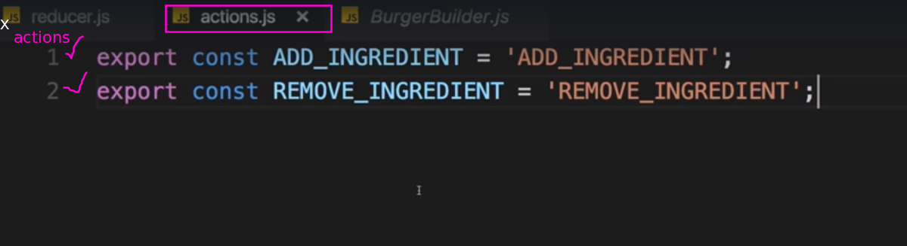
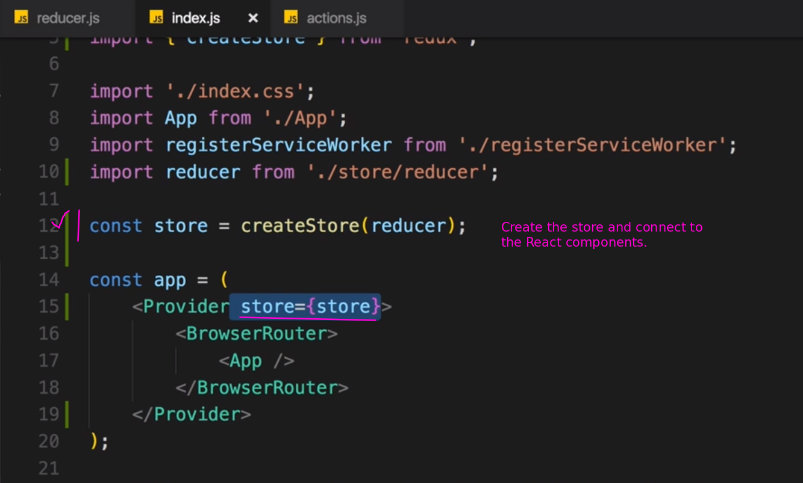

# S15 | Module Introdution
---

# S15 | Installing Redux and React Redux
---

# S15 | Basic Redux Setup
---

# S15 | Finishing the Reducer for Ingredients
---

# S15 | Connecting the Burger Builder Container to our Store
---

# S15 | Working on the Total Price Calculation
---

# S15 | Redux & UI State
---

# S15 | Adjusting Checkout and Contact Data
---

 
