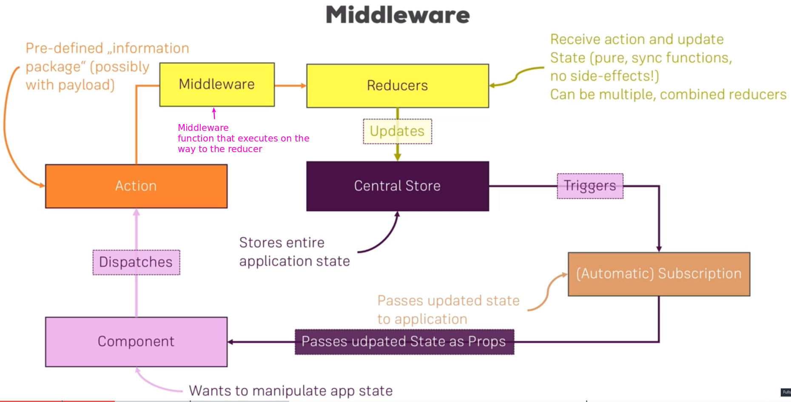

# S16 | Module Introdution
---

Middleware basically is a term used for functions or the code
general you hook into a process which then gets executed as part of that process without stopping it. 

PROCEED FROM HERE 
https://www.udemy.com/course/react-the-complete-guide-incl-redux/learn/lecture/8226884#overview