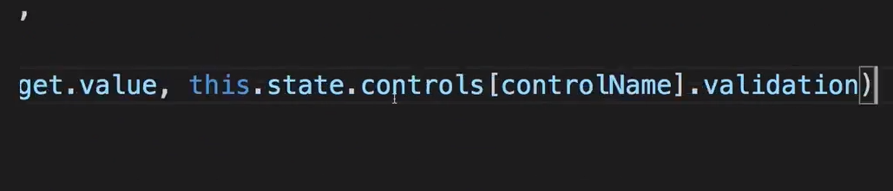
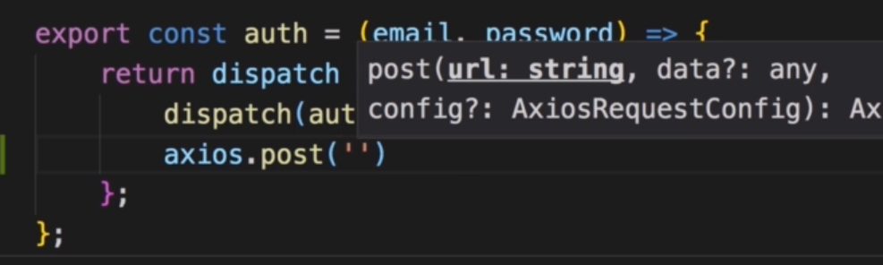
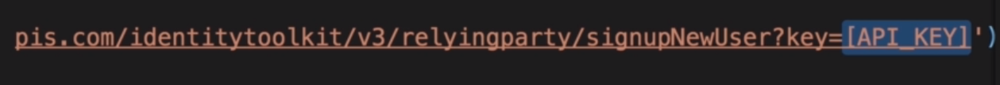
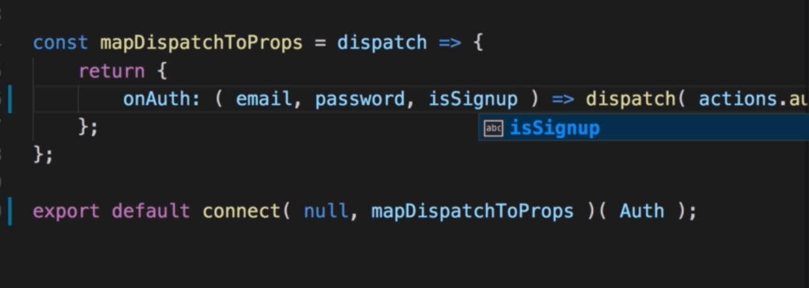

# S18 | Module Introdution
---
Authentication Logic
`file`

 - this authentication is for single page. Where we dont have to authenticate a user for every page like in traditional apps. 
 - In SPAS we only deal with a single file coming from the server i.e index.html
 - In Traditional multi page app we have multiple pages coming from server where we have to maintain authentication using session and cookies.

 # S18 | Understanding Authentication in Single Page Applications
---
How it works 
`file`

- The SPA running on the browser will send the Auth data i.e email/password of the user.
- The server will validate the Auth data and send back a token (instead of a session as in a traditional app).
- This token can then be stored in the browser in the localStorage so that the token persists on page reload. 
- When we need to access protected resource like changing password or creating a blog post we will send this token along with the request. The server can validates the token. Unlike MPAs where a server maintains a session and can cross check the Auth data on every request.
- Note that only  tokens gererated by the server and sent to the client will be valid. 
- THe server here is a RESTful APIs server

 # S18 | Required App Adjustments
---
## Required adjustments
`file`
 

## Auth.js - Creating a signup and signin view
Creating a new component as container  
`Auth.js`
 

Add form controls
`Auth.js`

Control - Email
`Auth.js`
 

Control - Password
`Auth.js`
 

Import the UI Input and Button custom components
`Auth.js`
 

Render() - loop through the form controls 
`Auth.js`
 

Creating a new component as container  
`Auth.js`
 

Render() - form and the button
`Auth.js`
 

## App.js - Setup the Route
Current setup
`App.js`
 

Add the Auth Route
`App.js`
 

## NavigationItems.js - Add new nav
Add Authenticate to Navigation - so that we can reach the Auth route
`NavigationItems.js`
 

## Output 
Cannot see the inputs
`file`
 

## Auth.css - Styling 
Lets add some stying to the form
`Auth.css`
 

Import css
`Auth.js`
 

Add to the Jsx div
`Auth.js`
 

## Form Validation
Add the method for validation
`Auth.js`
 
- copied from contactData

Continued
`Auth.js`
 

input Change Hadler
`Auth.js`
 

Cont..
`Auth.js`
 

Update the state after validation of each control
`Auth.js`
 

Connect the event handler
`Auth.js`
 
- see the `changed` prop

## Output - Validation
Validation working
`file`
 
- see the red password field

# S18 | Adding Actions
---
We want the submit button in the Authenticate page to work
`file`

- We will create action creators 

## auth.js - Actions - Creating Action creators
Create `auth.js` in the actions folder 
`actions/auth.js`
 
- this will hold the authentication related actions

Create actionTypes
`actions/actionTypes.js`
 
- AUTH_START, AUTH_SUCCESS, AUTH_FAIL 

`authStart` - action creator
`actions/auth.js`
 
- this action creator will be used to set a loading state and show a spinner
- there is no payload

`authSuccess` - action creator
`actions/auth.js`
 
- payload passed is authData - we will see this later in details

`authFail` - action creator
`actions/auth.js`
 

`auth` - action creator
`actions/auth.js`
 
- this holds the async code doing the authentication
- we expect the email and password
- we get the dispatch as an argument in this function - due to `REDUX THUNK`
- in there we want to authenticate the user
 
`auth` - action creator
`actions/auth.js`
 
- we will dispatch authStart to at least set this state 

## Auth.js - Container - Connect actions to container so that we can dispatch them 
 Import my actions 
`actions/index.js`
 
 - add the auth action creators to the index.js file where we bundle all the exports from the actions folder

 Import my actions 
`containers/auth.js`
 

mapDispatchToProps - configure this so that we can use props to dispatch actions
`containers/auth.js`
 

Cont.. 
`containers/auth.js`
 
- dispatch the `auth()` action
- pass on the email and password to the actions

mapDispatchToProps only makes sense if we **connect** to this container
import `connect` from react-redux
`containers/auth.js`
  

execute `Connect`
`containers/auth.js`
 
- 1st arg : null - `mapStateToProps` is null
- 2nd arg : mapDispatchToProps
- Now we can execute `onAuth()` on our props in this container
- We want to do this when the form is submitted

Add Form Submit Handler
`containers/auth.js`
 

Add the method to the container
`containers/auth.js`
 
- we expect to get the event as 1st arg
- we need to pass the email and password
- we get email/pass from the state

Get email/pass
`containers/auth.js`
 
- this.state.controls.email.value
- this.state.controls.password.value

## Output
Click submit
 

AUTH_START action was dispatched 
``
 
- but of course nothing else works
- we will do the async call and authenticate using firebase

# S18 | Getting a Token from the Backend
---
What you will not get in this course
- how to validate email on the server 
- how to create that token
- this is not covered here

Firebase - Authentication - Signin method
`file`
 

Enable email 
`file`
 
- now we reach certain REST API end points to sign up user and get a token

To find out which address we need to send that 
- Google firebase rest auth
`flle`
 
- the 2nd result

Find the endpoint to sign up new users 
`file`
 
- copy the endpoint and send the request

We will use the default axios instance 
- Import axios
`actions/auth.js`
 
- then i can start sending requests

Send request to the endpoint 
`actions/auth.js`
 
 
 - `API KEY` portion - replace with our project api key

Firebase - Authentication - Web Setup
`actions/auth.js`
 
- copy the API KEY for our project without quotes
- replace within the firebase endpoint for user sign up
- this identifies our application

Send the expected data to the endpoint
``
 

construct authData
`actions/auth.js`
 

Attach this data to the post request
 

Send response.data to authSuccess on success 
Send err to authFail on failure
 

## Output 
Submit 
`file`
 

Redux 
`file`
 
- We see AUTH_START and AUTH_SUCCESS

See console to see the response data we get back
`file`
 
- shows that idToken is valid for 3600 sec - 1hour 
- the refreshToken can be use to get a new idToken

Firebase - output - user created with userID
`file`
 

If invalid form data is sent - we get an error

 

For subsequent requests we will use the idToken and the refreshToken and the expiresIn info.

# S18 | Adding Sign-In
## Container - Auth.js
Adding a sign in button
`containers/auth.js`
 
 

isSignup - state property
`containers/auth.js`
 
- this property should be true initially

Switch the isSignup to false when submit button is clicked
`containers/auth.js`
 

Render() - Button
`containers/auth.js`
 
 

Recall - Button.js
`components/Button.js`
 

`clicked` - defined
`containers/auth.js`
 

## Actions - Auth.js
To make it really functional we need to something in the `submitHandler`
We always call onAuth where we always execute the `auth` action 
`actions/auth.js`
 

We want to get a third argument in the action - signup or signin
`actions/auth.js`
 

signin url 
 

We will send the request to different urls for different methods  
`actions/auth.js`
  
  
- send the post req to the `url` 

## Container - Auth.js
Pass the isSignup argument to the action creator from the container
`containers/auth.js`
  
  
  

Pass the isSignup from the submitHandler
`containers/auth.js`
 
  

## Output
When trying to sign up with same email 
  
- AUTH_FAIL
- EMAIL EXISTS

When signing in as existing user r
  
- AUTH_SUCCESS
- We get back the token 
- next challenge is to store the token so that we can use it in the future

# S18 | Storing the Token
---
## Reducer - Auth.js
Create a new reducer - auth.js
`reducers/auth.js`
 
- we will handle the auth actions and auth state here 

initialState and reducer function 
`reducers/auth.js`
 

Import the updateObject from utility file 
`reducers/auth.js`
 

use updateOBject to update the state
`reducers/auth.js`
 
- set the error to null and loading to true for `AUTH_START` action type

Return the state for default case 
`reducers/auth.js`
 

Make the reducer leaner and thinner in code
`reducers/auth.js`
 
- define authStart function which takes the state and action and returns the new state.

`authSuccess` - return the state for AUTH_SUCCESS
`reducers/auth.js`
 
- set the token and userid from the action payload
- set error as null 
- set loading as false - since we are done loading

`authFail` - return state for AUTH_FAIL
`reducers/auth.js`
 

Use the functions in the reducer case statements
`reducers/auth.js`
 

## Combine the reducer - Index.js
Now we want to combine this reducer with other reducers
`index.js`
 
- import the auth reducer first 
- auth property holds the auth reducer
- combineReducers combines all the reducers

## Note
We are not passing the idToken or the userId when we dispatch the actions 
`actions/auth.js`
 

Lets inspect the response we get when we sign in
 
 
- idToken is the token 
- localId is the userID

## Action - Auth.js
Current Code
`actions/auth.js`
 

authSuccess method now expects token and userId as args
`actions/auth.js`
 
- set these as the payloads for the action sent to the reducer
- type, token , userId
- we try to extract these payload info in the reducer as idToken and userId
  `reducers/auth.js` 
   

Pass on the token and userId where the action is dispatched
CUrrent Code
`actions/auth.js`
 

Pass the idToken and localId
`actions/auth.js`
 

## Output
On Submit while in SIGN-IN mode , we retreive the token and userId
 
- we are thus storing the authentication status
- but we are not yet showing a spinner while authenticating in progress

# S18 | Adding a Spinner
--- 
Adding a spinner while authentication is in progress.

## Spinner while Authentication
#### Container - Auth.js
Import the Spinner Component
`containers/auth.js`
 

Now I want to display the spinner as long as we are loading and for that,
- I need to know if we're loading and we're storing that information in our auth state, for that
- I need to get a piece of that state in my auth container
- This is a case for const mapStateToProps, 
- There we get the state and can now map a slice of it to our local props.
  
`containers/auth.js`
 
- We get the state and can now map a slice of it to our local props 'loading'

Pass mapStateToProps to our connect function
`containers/auth.js`
 

In render method we can render a Spinner
`containers/auth.js`
 
- That should be all

## Show Error If Wrong Data Submitted
#### Container - Auth.js
Map the error from the auth slice to local error prop
`containers/auth.js`
 

Display an error message 
`containers/auth.js`

Output the error message above the form
`containers/auth.js`
  

#### Actions - Auth.js
Before we see something we have to ensure that we store that error
`actions/auth.js`
 

## Output
Invalid email
 

Email exists
 