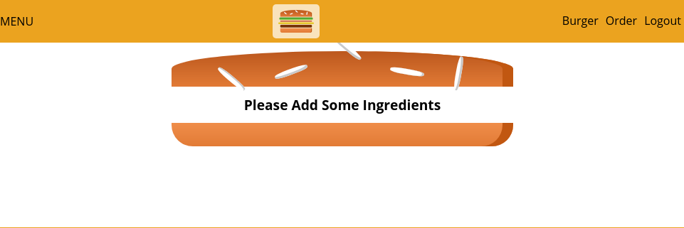

# Section-8 | A Real App: The Burger Builder (Basic Version)

## S8 | Planning Reat App

---

 


## S8 | Layout and Component Tree

---


 

### App | ShoppingCart


 

 


## S8 | Planning the State

---

 


## S8 | Setting up the Project

---

### Steps 

1. Create react app - start a project with create create app
2. Eject the project - to ensure that the css applied is not global. `npm run eject`
3. Edit the `webpack.config` file if required. Latest react version supports CSS Modules out of the box. See [Adding a CSS Modules Stylesheet](https://facebook.github.io/create-react-app/docs/adding-a-css-modules-stylesheet).
4. Remove files and code not required in the project like logo, App.css
5. Import Google fonts and add to `index.html` in the public folder.

### Code

`index.css`

```css
body {
  margin: 0;
  padding: 0;
  font-family: 'Open Sans', sans-serif;
}
```

## S8 | Creating a Layout component

---

### Folder structure

 
 

### Code

`Aux.js`
```js
const aux = (props) => props.children

export default aux;
```

`Layout.js`
```js
import React from 'react'
import Aux from '../../hoc/Aux'

const layout = (props) => {
    return (
        <Aux>
            <div>Toolbar, SideDrawer, Backdrop</div>
            <main>
                {props.children}
            </main>
        </Aux>
    )
}
export default layout; 
```

`App.js`
```js
import React, { Component } from 'react';
import Layout from './components/Layout/Layout';

class App extends Component {
  render() {
    return (
      <div>
        <Layout>  
          <p>Hello Arif - This is the Main Content</p>
        </Layout>
      </div>
    );
  }
}

export default App;

```

### Output


## S8 | Starting Implementation of the Burger Builder Component

---

### Code

`BurgerBuilder.js`
```js
import React, { Component } from "react";
import Aux from "../../hoc/Aux";

class BurgerBuilder extends Component {
  render() {
    return (
      <Aux>
        <div>Burger</div>
        <div>Build Controls</div>
      </Aux>
    );
  }
}
export default BurgerBuilder;
```

`Layout.module.css`
* this is the new way of implementing css-modules. We just need to add ".modules.css" to the file.

```css
/* module based css file - which is only applicable for files importing it*/
.Layout {
    margin-top: 20px;
}

```
`Layout.js`
```js
import React from 'react'
import Aux from '../../hoc/Aux'
+ import classes from './Layout.module.css'

const layout = (props) => {
    return (
        <Aux>
            <div>Toolbar, SideDrawer, Backdrop</div>
+            <main className={classes.Layout}>
                {props.children}
            </main>
        </Aux>
    )
}

export default layout; 
```

`App.js`
```js
import React, { Component } from 'react';
import Layout from './components/Layout/Layout';
import BurgerBuilder from './containers/BurgerBuilder/BurgerBuilder';

class App extends Component {
  render() {
    return (
      <div>
        <Layout>  
+          <BurgerBuilder/>
        </Layout>
      </div>
    );
  }
}

export default App;
```

### Output

 
 

## S8 | Adding a Dynamic Ingredient Component

---

### Code

`BurgerIngredient.module.css`
```css
/* Added from the course resource */
```

`BurgerIngredient.js` ( new )

```js
import React from "react";
import classes from "./BurgerIngredient.module.css";

const burgerIngredient = ({ type }) => {
  let ingredient = null;
  switch (type) {
    case "bread-bottom":
      ingredient = <div className={classes.BreadBottom} />;
      break;
    case "bread-top":
      ingredient = (
        <div className={classes.BreadTop}>
          <div className={classes.Seeds1} />
          <div className={classes.Seeds2} />
        </div>
      );
      break;
    case "meat":
      ingredient = <div className={classes.Meat} />;
      break;
    case "cheese":
      ingredient = <div className={classes.Cheese} />;
      break;
    case "bacon":
      ingredient = <div className={classes.Bacon} />;
      break;
    case "salad":
      ingredient = <div className={classes.Salad} />;
      break;
    default:
      ingredient = null;
  }

  return ingredient;
};

export default burgerIngredient;
```

`Burger.js` ( new )

```js
import React from 'react';
import BurgerIngredient from './BurgerIngredient/BurgerIngredient'
const Burger = () => {
    return (
        <div style={{height: '700px'}}>
            <BurgerIngredient type="bread-top"/>
            <BurgerIngredient type="cheese"/>            
            <BurgerIngredient type="meat"/>
            <BurgerIngredient type="bacon"/>
            <BurgerIngredient type="salad"/>
            <BurgerIngredient type="bread-bottom"/>
        </div>
    );
};
export default Burger;

```

`BurgerBuilder.js`

```js
import React, { Component } from "react";
import Aux from "../../hoc/Aux";
+ import Burger from '../../components/Burger/Burger'

class BurgerBuilder extends Component {
  render() {
    return (
      <Aux>
+        <Burger/>
        <div>BuildControls</div>
      </Aux>
    );
  }
}

export default BurgerBuilder;

```

### Output 

 


## S8 | Adding Proptype Validation

---

1. **Install** - `$ npm install --save prop-types`

2. **Class** - Can only be used with Class components

3. **Code** - How to use?

```js
import Proptypes from 'prop-types'

Class BurgerIngredient extends Component { //... }

BurgerIngredient.propTypes = {
  type: PropTypes.string.isRequired
}
```


## S8 | Starting the Burger Component

---

`Burger.module.css` (new)
```css
.Burger {
    width: 100%;
    margin: auto;
    height: 250px;
    overflow: scroll;
    text-align: center;
    font-weight: bold;
    font-size: 1.2rem;    
}

@media (min-width: 450px) {
    .Burger {
        width: 80%;
    }
}

@media (min-width: 800px) {
    .Burger {
        width: 700px;
    }
}

``` 

`Burger.js` (updated)
```js
+ import classes from './Burger.module.css'

const Burger = () => {
    return (
+        <div className={classes.Burger}>
            <BurgerIngredient type="bread-top"/>
            <BurgerIngredient type="cheese"/>          
            <BurgerIngredient type="meat"/>
            <BurgerIngredient type="bacon"/>
            <BurgerIngredient type="salad"/>
            <BurgerIngredient type="bread-bottom"/>
        </div>
    );
};

```

## S8 | Outputting Burger Ingredients Dynamically

---

### Code 

`BurgerBuilder.js` (updated)

```js
import React, { Component } from "react";
import Aux from "../../hoc/Aux";
import Burger from '../../components/Burger/Burger'

class BurgerBuilder extends Component {
+  state = {
      ingredients : {
          salad: 1,
          bacon: 1,
          cheese: 2,
          meat: 2
      }
  }
  render() {
    const {ingredients} = this.state; //destructuring
    return (
      <Aux>
        <Burger ingredients={ingredients}/>
        <div>BuildControls</div>
      </Aux>
    );
  }
}

export default BurgerBuilder;

```

`Burger.js`

```js
import React from 'react';
import BurgerIngredient from './BurgerIngredient/BurgerIngredient'
import classes from './Burger.module.css'

const Burger = ({ingredients}) => { //destructuring props
    const ingKeys = Object.keys(ingredients);
    // const ingKeys = ['cheese']
+    const allIngredientsJsx = ingKeys.map((ingKey,i)=>{
        const qty = ingredients[ingKey];
        const qtyArr = [...new Array(qty)]; /** without spread(...) operator empty array is created. Empty array cannot be mapped over */
        console.log("--->>",ingKey,i,ingredients[ingKey],qtyArr);

        const qtyArrJsx = qtyArr.map((_,i) => {
            console.log("--->>",i);
            return <BurgerIngredient key ={ingKey + i}type={ingKey}/>
        })
        return qtyArrJsx;

    })
    console.log(allIngredientsJsx);
    return (
        <div className={classes.Burger}>
            <BurgerIngredient type="bread-top"/>
    +        {allIngredientsJsx}
            <BurgerIngredient type="bread-bottom"/>
        </div>
    );
};

export default Burger;

```
 
 

```js
  state = {
        ingredients : {
            salad: 1,
            bacon: 1,
            cheese: 2,
            meat: 2
        }
    }
```


## S8 | Calculating the Ingredient Sum Dynamically

---

**We need to flatten the following nested array**

 

`Burger.js`

```js
/** Lesson - How to flatten a nested array structure
   * use reduce to iteratively concat an array
   * then you can count the length to find out the total number of all ingredients
   */
const flattenIng = allIngredientsJsx.reduce((arr, el) => {
  return arr.concat(el);
}, []);

```

**Output**
 


## S8 | Adding the Build Control Component

---

`BuildControls.js`

```js
import React from 'react'

const buildControls = (props) => {
    return (
        <div>

        </div>
    )
}

export default buildControls;
``` 

`BuildControl.js`

```js
import React from "react";
import classes from "./BuildeControl.module.css";

const buildControl = ({ label }) => {
  return (
    <div className={classes.BuildControl}>
      <div className={classes.Label}>{label}</div>
      <button className={classes.Less}>Less</button>
      <button className={classes.More}>More</button>
    </div>
  );
};

export default buildControl;

```


## S8 | Outputting Multiple Build Controls

---

`BuildControls.js` (updated)

```js
import React from "react";
import classes from "./BuildControls.module.css";
import BuildControl from "./BuildControl/BuildControl";

+const controls = [
  { label: "Salad", type: "salad" },
  { label: "Bacon", type: "bacon" },
  { label: "Cheese", type: "cheese" },
  { label: "Meat", type: "meat" }
];

const buildControls = props => {
+  const controlsJsx = controls.map(ctrl => (
    <BuildControl key={ctrl.label} label={ctrl.label} />
  ));
  return (
        <div className={classes.BuildControls}>
+            {controlsJsx}
        </div>
  );
};

export default buildControls;

```

## S8 | Connecting State to Build Controls

## S8 | Removing Ingredients Safely

---

### Code 

`BurgerBuilder.js` (updated)

```js
import React, { Component } from "react";
import Aux from "../../hoc/Aux";
import Burger from '../../components/Burger/Burger'
import BuildControls from '../../components/Burger/BuildControls/BuildControls'

+ const INGREDIENT_PRICES = {
  salad : 1,
  cheese: 2,
  meat: 3,
  bacon: 10  
}

class BurgerBuilder extends Component {
  state = {
      ingredients : {
          salad: 0,
          bacon: 0,
          cheese: 0,
          meat: 0
      },
+      totalPrice: 4
  }
  
+  addIngredientHandler = (type) => {
    const oldCount = this.state.ingredients[type]
    
    const ingredients = {...this.state.ingredients}; //immutable 
    ingredients[type] = oldCount + 1

    // const oldPrice = this.state.totalPrice;
    const addedPrice = INGREDIENT_PRICES[type];

    this.setState((prevState)=>{
      return {
        ingredients: ingredients,
        totalPrice: prevState.totalPrice + addedPrice
      }
    });    
  }
+  removeIngredientHandler = (type) => {
    const oldCount = this.state.ingredients[type]
    if(oldCount === 0) return; 

    const ingredients = {...this.state.ingredients}; //immutable 
    ingredients[type] = oldCount - 1

    const reducePrice = INGREDIENT_PRICES[type];

    this.setState((prevState)=>{
      return {
        ingredients: ingredients,
        totalPrice: prevState.totalPrice - reducePrice
      }
    });    
  }

  render() {
    const {ingredients} = this.state; //destructuring
    
  +  const ingKeys = Object.keys(ingredients);
     
  +  const disabledInfo = ingKeys.reduce((dsbInf,ingKey) => {
       dsbInf[ingKey] = ingredients[ingKey] <= 0;
       return dsbInf;
    },{}) // {salad: true, bacon: true...}

    return (
      <Aux>
        <Burger ingredients={ingredients}/>
        <BuildControls
  +        addIngredient = {this.addIngredientHandler}
  +        removeIngredient = {this.removeIngredientHandler}
  +        disabledInfo = {disabledInfo}
        />
      </Aux>
    );
  }
}

export default BurgerBuilder;

```

`BuildControls.js` (updated)

```js
import React from "react";
import classes from "./BuildControls.module.css";
import BuildControl from "./BuildControl/BuildControl";

const controls = [
  { label: "Salad", type: "salad" },
  { label: "Bacon", type: "bacon" },
  { label: "Cheese", type: "cheese" },
  { label: "Meat", type: "meat" }
];

const buildControls = ({ addIngredient, removeIngredient, disabledInfo }) => {
  const controlsJsx = controls.map(ctrl => (
    <BuildControl
       key={ctrl.label}
       label={ctrl.label}
+      type={ctrl.type}
+      add={addIngredient}
+      remove={removeIngredient}
+      disabledInfo = {disabledInfo[ctrl.type]}
    />
  ));
  return <div className={classes.BuildControls}>
      {controlsJsx}
    </div>;
};

export default buildControls;

```

`BuildControl.js` (updated)

```js
import React from "react";
import classes from "./BuildControl.module.css";

+ const buildControl = ({ label, type, add, remove, disabledInfo }) => {
  return (
    <div className={classes.BuildControl}>
      <div className={classes.Label}>{label}</div>
      <button 
         className={classes.Less} 
+        onClick={()=>remove(type)}
+        disabled={disabledInfo}>Less
      </button>
      <button 
         className={classes.More} 
+        onClick={()=>add(type)}>More
      </button>
    </div>
  );
}; 

export default buildControl;

```

### Output

 

 

See that the Less buttons are disabled for ingredients with 0 quantity. This is done using the `disabled info`.


## S8 | Displaying and Updating the Burger Price

---

### Code 

`BuildControls.js`

```js
import React from "react";
import classes from "./BuildControls.module.css";
import BuildControl from "./BuildControl/BuildControl";

const controls = [
  { label: "Salad", type: "salad" },
  { label: "Bacon", type: "bacon" },
  { label: "Cheese", type: "cheese" },
  { label: "Meat", type: "meat" }
];

+ const buildControls = ({ addIngredient, removeIngredient, disabledInfo, totalPrice }) => {
  const controlsJsx = controls.map(ctrl => (
    <BuildControl
      key={ctrl.label}
      label={ctrl.label}
      type={ctrl.type}
      add={addIngredient}
      remove={removeIngredient}
      disabledInfo = {disabledInfo[ctrl.type]}
    />
  ));
  return (
    <div className={classes.BuildControls}>
+        <p>Total Price : {totalPrice}</p>
        {controlsJsx}
    </div>
  );
};

export default buildControls;

```

`BurgerBuilder.js`

```js
//.. Codes above remian unchanged

 render() {
+   const {ingredients, totalPrice} = this.state; //destructuring
    
    const ingKeys = Object.keys(ingredients);
    
    const disabledInfo = ingKeys.reduce((dsbInf,ingKey) => {
       dsbInf[ingKey] = ingredients[ingKey] <= 0; 
       return dsbInf;
    },{})

    return (
      <Aux>
        <Burger ingredients={ingredients}/>
        <BuildControls
          addIngredient = {this.addIngredientHandler}
          removeIngredient = {this.removeIngredientHandler}
          disabledInfo = {disabledInfo}
+         totalPrice = {totalPrice}
        />
      </Aux>
    );
  }

export default BurgerBuilder;
```
### Output 

Total price added 

 

## S8 | Adding the Order Button

---

### Using `this.setstate` multiple times in react component

[Stackoverflow Answer](https://stackoverflow.com/questions/33613728/what-happens-when-using-this-setstate-multiple-times-in-react-component)

#### Summary:
  1. using this.setstate multiple times does not cause multiple render in case of React-controlled synthetic event handlers.
  2. React batches state updates that occur in event handlers and lifecycle methods

### Code 

`BurgerBuilder.js`

```js
import React, { Component } from "react";
import Aux from "../../hoc/Aux";
import Burger from '../../components/Burger/Burger'
import BuildControls from '../../components/Burger/BuildControls/BuildControls'

const INGREDIENT_PRICES = {
  salad : 1,
  cheese: 2,
  meat: 3,
  bacon: 10  
}

class BurgerBuilder extends Component {
  state = {
      ingredients : {
          salad: 0,
          bacon: 0,
          cheese: 0,
          meat: 0
      },
      totalPrice: 4,
+      isPurchasable : false
  }
+ getDisabledInfo = (ingredients=this.state.ingredients) => {    
    const ingKeys = Object.keys(ingredients);
    const disabledInfo = ingKeys.reduce((dsbInf,ingKey) => {
      dsbInf[ingKey] = ingredients[ingKey] <= 0; 
      return dsbInf;
   },{}); // {salad: false, bacon: true ...}
   return disabledInfo;
  }
+ updatePurchaseState = (ingredients) => {
    const disabledInfo = this.getDisabledInfo(ingredients);
    const hasNoIngredients = Object.keys(disabledInfo)
    .reduce((result, ingKey) => result && disabledInfo[ingKey], true)
    this.setState({isPurchasable : !hasNoIngredients})
  }
  addIngredientHandler = (type) => {
    const oldCount = this.state.ingredients[type]
    
    const ingredients = {...this.state.ingredients}; //immutable 
    ingredients[type] = oldCount + 1

    // const oldPrice = this.state.totalPrice;
    const addedPrice = INGREDIENT_PRICES[type];
    
    this.setState((prevState)=>{
      return {
        ingredients: ingredients,
        totalPrice: prevState.totalPrice + addedPrice
      }
    }); 
+   this.updatePurchaseState(ingredients);
  }
  removeIngredientHandler = (type) => {
    const oldCount = this.state.ingredients[type]
    if(oldCount === 0) return;
    
    const ingredients = {...this.state.ingredients}; //immutable 
    ingredients[type] = oldCount - 1

    const reducePrice = INGREDIENT_PRICES[type];

    this.setState((prevState)=>{
      return {
        ingredients: ingredients,
        totalPrice: prevState.totalPrice - reducePrice
      }
    });
    /**
    * passing this.state.ingredients does not work due to the way setstate works in batches. 
    */
+   this.updatePurchaseState(ingredients); 
  }
  render() {    
    
    const {ingredients, totalPrice, isPurchasable} = this.state; //destructuring   
+    const disabledInfo = this.getDisabledInfo(ingredients); // {salad: false, bacon: true ...}

    return (
      <Aux>
        <Burger ingredients={ingredients}/>
        <BuildControls
          addIngredient = {this.addIngredientHandler}
          removeIngredient = {this.removeIngredientHandler}
          disabledInfo = {disabledInfo}
          totalPrice = {totalPrice}
+          hasNoIngredients = {!isPurchasable}
        />
      </Aux>
    );
  }
}

export default BurgerBuilder;

```

`BuildControls.js`

```js
import React from "react";
import classes from "./BuildControls.module.css";
import BuildControl from "./BuildControl/BuildControl";

const controls = [
  { label: "Salad", type: "salad" },
  { label: "Bacon", type: "bacon" },
  { label: "Cheese", type: "cheese" },
  { label: "Meat", type: "meat" }
];

+ const buildControls = ({ addIngredient, removeIngredient, disabledInfo, totalPrice, hasNoIngredients }) => {

  const controlsJsx = controls.map(ctrl => (
    <BuildControl
      key={ctrl.label}
      label={ctrl.label}
      type={ctrl.type}
      add={addIngredient}
      remove={removeIngredient}
      disabledInfo = {disabledInfo[ctrl.type]}
    />
  ));

  
  return (
    <div className={classes.BuildControls}>
        <p>Total Price : <strong>{totalPrice}</strong></p>
        {controlsJsx}
+       <button className={classes.OrderButton} disabled={hasNoIngredients}>ORDER NOW</button>
    </div>
  );
};

export default buildControls;

```

### Output

Before 
 
After
 


## S8 | Creating the Order Summary Modal

### Idea 
The idea behind the modal is to have a wrapping element which provides the styling which then simply wraps itself about any content we want to show in that modal.


### Code 

`Modal.module.css`

```css
.Modal {
    position: fixed; // scroll has no effect on postn
    z-index: 500;
    background-color: white;
    width: 70%;
    border: 1px solid #ccc;
    box-shadow: 1px 1px 1px black;
    padding: 16px;
    left: 15%;
    top: 30%; 
    box-sizing: border-box;
    transition: all 0.3s ease-out;
}

.Hide {
    transform: translateY(-100vh);
    opacity: 0;        
}

.Show {
    transform: translateY(0);
    opacity: 1;        
}

@media (min-width: 600px) {
    .Modal {
        width: 500px;
        left: calc(50% - 250px);
        
    }
}
```

`Modal.js`

```js
import React from 'react';
import classes from './Modal.module.css'

const modal = (props) => {
    return (
        <div className = {classes.Modal}>
            {props.children}
        </div>
    );
};

export default modal;
```

`utilities.BurgerBuilder.js` (new)

```js
const getIngredientsArray = (ingredients) => { // {salad:1, bacon:2 ...}
    const ingKeys = Object.keys(ingredients);    
    return ingKeys.map(ingKey => {
        return {name: ingKey, qty: ingredients[ingKey]};
    })
}

export default {
    getIngredientsArray: getIngredientsArray
};
```

`OrderSummary.js` (new)

```js
import React from "react";
import Aux from "../../../hoc/Aux";
import burgerBuilderUtility from "../../../utilities/BurgerBuilder";

const orderSummary = ({ ingredients }) => {
  const ingArr = burgerBuilderUtility.getIngredientsArray(ingredients); //[{name: salad, qty:1},... ]
  const ingListJsx = ingArr.map(ing => {
    return (
      <li key={ing.name}>
        {ing.name} : {ing.qty}
      </li>
    );
  });

  return (
    <Aux>
      <h3>Your Order</h3>
      <p>You have ordered the following ingredients :</p>
      <ul>{ingListJsx}</ul>
      <p>Continue to Checkout</p>
    </Aux>
  );
};

export default orderSummary;

```

`BurgerBuilder.js` (updated)

```js
import React, { Component } from "react";
import Aux from "../../hoc/Aux";
import Burger from '../../components/Burger/Burger'
import BuildControls from '../../components/Burger/BuildControls/BuildControls'
+ import Modal from '../../components/UI/Modal/Modal'
+ import OrderSummary from '../../components/Burger/OrderSummary/OrderSummary'

class BurgerBuilder extends Component {
  //...
  //...
  render() {
  //...
    return (
          <Aux>
+            <Modal>
              <OrderSummary ingredients = {ingredients} />
            </Modal>
          </Aux>
    )
  }
}
export default BurgerBuilder;
```

### Output

 

## S8 |  Showing and Hiding the Modal (with Animation)

### Code 


`BurgerBuilder.js` (updated)

```js 
//...
class BurgerBuilder extends Component {
  state = {
      ingredients : {
          salad: 0,
          bacon: 0,
          cheese: 0,
          meat: 0
      },
      totalPrice: 4,
      isPurchasable : false,
+     isPurchasing : false
  }
+ placeOrderHandler = () => {
    this.setState({isPurchasing: true})
  }
  //...
  //...
  render() {    
    
    const {ingredients, totalPrice, isPurchasable, isPurchasing} = this.state; //destructuring   
    const disabledInfo = this.getDisabledInfo(ingredients); // {salad: false, bacon: true ...}

    return (
      <Aux>
        <Modal show = {isPurchasing}>
          <OrderSummary ingredients = {ingredients} />
        </Modal>
        <Burger ingredients = {ingredients}/>
        <BuildControls
          addIngredient = {this.addIngredientHandler}
          removeIngredient = {this.removeIngredientHandler}
          disabledInfo = {disabledInfo}
          totalPrice = {totalPrice}
          hasNoIngredients = {!isPurchasable}
+         placeOrder = {this.placeOrderHandler}
        />
      </Aux>
    );
  }
}
export default BurgerBuilder;
```

`Modal.js` (updated)

```js 
import React from 'react';
import classes from './Modal.module.css'

+const modal = ({show, children}) => {

+    let modalClasses = [classes.Modal]
+    if(show) modalClasses.push(classes.Show);
+    else modalClasses.push(classes.Hide);

    return (
+        <div className = {modalClasses.join(" ")}>
            {children}
        </div>
    );
};

export default modal;
```

`BuildControls.js` (updated)

```js 
import React from "react";
import classes from "./BuildControls.module.css";
import BuildControl from "./BuildControl/BuildControl";

const controls = [
  { label: "Salad", type: "salad" },
  { label: "Bacon", type: "bacon" },
  { label: "Cheese", type: "cheese" },
  { label: "Meat", type: "meat" }
];

+ const buildControls = ({ addIngredient, removeIngredient, disabledInfo, totalPrice, hasNoIngredients, placeOrder }) => {

  const controlsJsx = controls.map(ctrl => (
    <BuildControl
      key={ctrl.label}
      label={ctrl.label}
      type={ctrl.type}
      add={addIngredient}
      remove={removeIngredient}
      disabledInfo = {disabledInfo[ctrl.type]}
    />
  ));

  
  return (
    <div className={classes.BuildControls}>
        <p>Total Price : <strong>{totalPrice}</strong></p>
        {controlsJsx}
        <button 
          className={classes.OrderButton} 
          disabled={hasNoIngredients}
+         onClick={placeOrder}>ORDER NOW</button>
    </div>
  );
};

export default buildControls;
      
```
## S8 | Implementing the Backdrop Component 

`Backdrop.js` (new)

```js
import React from 'react';

const backdrop = ({ hideModal }) => {
    const style = {
        width: '100vw',
        height: '100vh',
        backgroundColor: 'black',
        opacity: '0.3',
        zIndex: '250',
        position: 'fixed',
        left:'0',
        top: '0'
    }
    return (
        <div 
            style={style}
            onClick={hideModal}>          
        </div>
    );
};

export default backdrop;
```

`Modal.js` 
```js
import React from 'react';
import classes from './Modal.module.css'
import Backdrop from '../Backdrop/Backdrop'
import Aux from '../../../hoc/Aux'

const modal = ({show, children, hideModal}) => {

    let modalClasses = [classes.Modal];
+   let backdrop = null;

    if(show) {
        modalClasses.push(classes.Show);
+       backdrop = (
            <Backdrop hideModal={hideModal}/>
        )
    }
    else modalClasses.push(classes.Hide);

    return (
        <Aux>
+           {backdrop}
            <div className = {modalClasses.join(" ")}>
                {children}
            </div>
        </Aux>
       
    );
};

export default modal;
```


`BurgerBuilder.js` (updated)

```js 
//...
class BurgerBuilder extends Component {
  state = {
      ingredients : {
          salad: 0,
          bacon: 0,
          cheese: 0,
          meat: 0
      },
      totalPrice: 4,
      isPurchasable : false,
     isPurchasing : false
  }
+ hideModalHandler = () => {
    this.setState({isPurchasing : false});
  }
  //...
  //...
  render() {    
    
    const {ingredients, totalPrice, isPurchasable, isPurchasing} = this.state; //destructuring   
    const disabledInfo = this.getDisabledInfo(ingredients); // {salad: false, bacon: true ...}

    return (
      <Aux>
+        <Modal show = {isPurchasing} hideModal={this.hideModalHandler}>
          <OrderSummary ingredients = {ingredients} />
        </Modal>
        <Burger ingredients = {ingredients}/>
        <BuildControls
          addIngredient = {this.addIngredientHandler}
          removeIngredient = {this.removeIngredientHandler}
          disabledInfo = {disabledInfo}
          totalPrice = {totalPrice}
          hasNoIngredients = {!isPurchasable}
          placeOrder = {this.placeOrderHandler}
        />
      </Aux>
    );
  }
}
export default BurgerBuilder;
```
### Output


## S8 | Adding a Custom Button Component
## S8 | Implementing the Button Component

`BurgerBuilder.js` 

```js
//...
class BurgerBuilder extends Component {
  state = {
      ingredients : {
          salad: 0,
          bacon: 0,
          cheese: 0,
          meat: 0
      },
      totalPrice: 4,
      isPurchasable : false,
     isPurchasing : false
  }
+ continuePurchaseHandler = () => {
    alert("Continue to Checkout")    
  }
+ placeOrderHandler = () => {
    this.setState({isPurchasing: true});
  }
  //...
  //...
  render() {
    
    const {ingredients, totalPrice, isPurchasable, isPurchasing} = this.state; //destructuring
    const disabledInfo = this.getDisabledInfo(ingredients); // {salad: false, bacon: true ...}

    return (
      <Aux>
        <Modal show = {isPurchasing} hideModal={this.hideModalHandler}>
          <OrderSummary ingredients = {ingredients} 
+           hideModal={this.hideModalHandler}
+           continuePurchase={this.continuePurchaseHandler} />
        </Modal>
        <Burger ingredients = {ingredients}/>
        <BuildControls
          addIngredient = {this.addIngredientHandler}
          removeIngredient = {this.removeIngredientHandler}
          disabledInfo = {disabledInfo}
          totalPrice = {totalPrice}
          hasNoIngredients = {!isPurchasable}
          placeOrder = {this.placeOrderHandler}
        />
      </Aux>
    );
  }
}
export default BurgerBuilder;
```

`OrderSummary.js`

```js
import React from "react";
import Aux from "../../../hoc/Aux";
import burgerBuilderUtility from "../../../utilities/BurgerBuilder";
import Button from '../../UI/Button/Button'

const orderSummary = ({ ingredients, hideModal, continuePurchase }) => {
  const ingArr = burgerBuilderUtility.getIngredientsArray(ingredients); //[{name: salad, qty:1},... ]
  const ingListJsx = ingArr.map(ing => {
    return (
      <li key={ing.name}>
        {ing.name} : {ing.qty}
      </li>
    );
  }); 

  return (
    <Aux>
      <h3>Your Order</h3>
      <p>You have ordered the following ingredients :</p>
      <ul>{ingListJsx}</ul>
      <p>Continue to Checkout</p>
+     <Button onClick = {hideModal} btnType="Danger">CANCEL</Button>
+     <Button onClick ={continuePurchase} btnType="Success">CONTINUE</Button>
    </Aux>
  );
};

export default orderSummary;

```

`Button.js` (new)
```js
import React from "react";
import classes from "./Button.module.css";
const button = ({ children, onClick, btnType }) => {
  return (
    <button 
        className={[classes.Button, classes[btnType]].join(" ")} 
        onClick={onClick}>
      {children}
    </button>
  );
};
export default button;
```

`Button.module.css`
```css
.Button {
    padding: 5px 20px;
    background-color:  black;
    opacity: 0.8;
    color: white;
    font-family: inherit;
    margin-right: 5px;
    font-size: 0.9rem;
    font-weight: bold;
    border: none;
    cursor: pointer;
    border: 1px black solid;
}
.Success {
    color: #11dd11;
}
.Danger {
    color: #e41111;
}
.Button:hover{
    background-color: white;    
}
```
### Output

Buttons added in order summary


## S8 | Adding the Price to Order Summary

`BurgerBuilder.js`

```js
//...

 <OrderSummary ingredients = {ingredients}
        hideModal = {this.hideModalHandler}
        continuePurchase = {this.continuePurchaseHandler} 
+       totalPrice = {totalPrice}/>

//...
```
 
`OrderSummary.js`

```js
//...

<p><strong> Total Price: {totalPrice}</strong></p>

//...
```

### Output

Total price added to order summary.
  

## S8 | Adding a Toolbar
## S8 | Using a Logo in Our Application

### Output

Toolbar and Logo added.




### Code 

`Toolbar.js` (new)
```js
import React from 'react';
import classes from './Toolbar.module.css'
import Logo from '../../Logo/Logo'

const toolbar = (props) => {
    return (
        <header className = {classes.Toolbar}>
            <div>MENU</div>   
            <Logo/>
            <nav className = {classes.Navlist}>
                <ul>
                    <li>Burger</li>
                    <li>Order</li>
                    <li>Logout</li>
                </ul>
            </nav>
        </header>
    );
};

export default toolbar;
```

`Toolbar.module.css`
```css
.Toolbar {
    background-color: #eba31f;
    position: fixed;
    top: 0;
    left: 0;
    width: 100%;;
    height: 60px;
    overflow: hidden;
    z-index: 100;
    display: flex;
    justify-content: space-between;
    align-items: center;
}
.Navlist {
    height: 100%
}
.Navlist ul{        
    list-style: none;
    display: flex;
    justify-content: space-between
}
.Navlist li {
    padding: 18px 5px;
}
```

`Layout.js`
```js
import React from 'react'
import Aux from '../../hoc/Aux'
// import './Layout.css'
import classes from './Layout.module.css'
import Toolbar from '../Navigation/Toolbar/Toolbar'

const layout = (props) => {
    return (
        <Aux>
+           <Toolbar/>
            {/* <div>SideDrawer, Backdrop</div> */}
            <main className={classes.Main}>
                {props.children}
            </main>

        </Aux>
    )
}

export default layout;
```

`Logo.js`

```js
import React from 'react';
import logoImage from '../../assets/section-8/images/burger-logo.png'
import classes from '../Logo/Logo.module.css'

const logo = () => {
    return (
        <div className={classes.Logo}>            
            
        </div>
    );
};

export default logo;
```

`Logo.module.css`

```css
.Logo{
    height: 80%;
    background-color: rgb(255, 255, 255, 0.7);
    padding: 8px;
    border-radius: 5px;
}

.Logo img{
    height: 100%;
}
```


## S8 | Adding Resuable Navigation Items

### Output
 

### Code

`Toolbar.js`

```js
import React from 'react';
import classes from './Toolbar.module.css'
import Logo from '../../Logo/Logo'
import NavigationItems from '../NavigationItems/NavigationItems'

const toolbar = (props) => {
    return (
        <header className = {classes.Toolbar}>
            <div>MENU</div>   
            <Logo/>
+           <NavigationItems/>            
        </header>
    );
};

export default toolbar;
```

`NavigationItems.js`

```js
import React from "react";
import classes from './NavigationItems.module.css'
import NavigationItem from './NavigationItem/NavigationItem'

const navigationItems = () => {
  return (
    <nav className={classes.Navlist}>
      <ul>
        <NavigationItem text="Burger" path="/"/>
        <NavigationItem text="Order" path="/"/>
        <NavigationItem text="Logout" path="/"/>
      </ul>
    </nav>
  );
};

export default navigationItems;
```

`NavigationItems.module.css`

```css
.Navlist {
    height: 100%
}
.Navlist ul{        
    list-style: none;
    display: flex;
    justify-content: space-between;
    align-items: center;
    height: 100%;
}

```
`NavigationItem.js` (new)
```js
import React from 'react';
import classes from './NavigationItem.module.css'

const navigationItem = ({active, text, path}) => {
    return (
        <li className={classes.NavItem}>
            <a
              className = {active ? classes.active : null} 
              href={path}>{text}</a> 
        </li>
    );
};

export default navigationItem;
```

`NavigationItem.module.css`

```css
.NavItem {
    height: 100%;
    /* display: flex;
    justify-content: space-between;
    align-items: center;     */
}

.NavItem a {
    text-decoration: none;
    color: white;
    font: inherit;
    font-weight: bold;
    height: 100%;
    display: block;  /* so that the height has effect */
    padding: 17px 10px;
}

.NavItem a:hover,
.NavItem a.active  {
   background-color: rgb(0, 0, 0, 0.5) 
}
```

* [x] [30 Mar 2019]

## S8 | Creating a Responsive SideDrawer (Notes X) 
## S8 | Working on Responsive Adjustments 

### Objective 
1. We want to make a `Sidedrawer` that will show in mobile screens.
2. Here we will work on making the Logo responsive and resuable in both the `Toolbar` and the `SideDrawer`

### Output
  

 ### Code 

`SideDrawer.js` (new)
 ```js
import React from 'react'
import Logo from '../../Logo/Logo'
import NavigationItems from '../../Navigation/NavigationItems/NavigationItems'
import classes from "./SideDrawer.module.css";

const sideDrawer = (props) => {
  return (
    <div className={classes.SideDrawer}>
      <div className={classes.Logo}>
        <Logo/>
      </div>
      <NavigationItems/>
    </div>
  )
} 
export default sideDrawer;
 ```

`SideDrawer.module.css` (new)
 ```css
.SideDrawer {
  position: fixed;
  width: 250px;
  height: 100%;
  left: 0;
  top: 0;
  z-index: 200;
  background-color: rgb(255, 136, 0);
  padding: 32px 16px;
  box-sizing: border-box;
  transition: transform 0.8s ease-out;
}
@media (min-width: 500px) {
  .SideDrawer {
    display: none;
  }
}
.Open {
  transform: translateX(0);
}
.Close {
  transform: translateX(-100%);
}
.Logo {
  height: 50px;
  text-align: center;
}
```

`Toolbar.js`
```js
import React from 'react';
import classes from './Toolbar.module.css'
import Logo from '../../Logo/Logo'
import NavigationItems from '../NavigationItems/NavigationItems'

const toolbar = (props) => {
    return (
        <header className = {classes.Toolbar}>
            <div>MENU</div>
+           <div className={classes.Logo}>
              <Logo/>  
+           </div>
            <NavigationItems/>
        </header>
    );
};

export default toolbar;
```

`Toolbar.module.css`
```css
.Toolbar {
    background-color: #eba31f;
    position: fixed;
    top: 0;
    left: 0;
    width: 100%;;
    height: 60px;
    overflow: hidden;
    z-index: 100;
    display: flex;
    justify-content: space-between;
    align-items: center;
}
++
.Logo {
  height: 80%; /*this will control the Logo height*/
}
```

`Layout.js`
```js
const layout = (props) => {
    return (
        <Aux>
          <Toolbar/>
+         <SideDrawer/>
          <main className={classes.Main}>
              {props.children}
          </main>
        </Aux>
    )
}
export default layout;
```

## S8 | More About Responsive Adustments

### Objective 

 

1. Improve the nav links in the sidedrawer.
2. Make the nav links vertically alligned.
3. Hide the nav links from the toolbar while the side drawer is open.
4. Give some spacing between the Logo and the nav links in the sidedrawer.

### Output


### Code

`SideDrawer.module.css`
```css
.Logo {
  height: 100px;
  + text-align: center; 
  + margin-bottom: 2px; /* to create distance between the links and logo*/
}
```

`Toolbar.js`
```js
const toolbar = (props) => {
    return (
        <header className = {classes.Toolbar}>
            <div>MENU</div>   
            <div className={classes.Logo}>
              <Logo/>  
            </div>            
            // hide while in mobile view
+           <div className={classes.DesktopOnly}> 
              <NavigationItems/>
            </div>
            
        </header>
    );
};
```

`Toolbar.module.css` 
```css
.Toolbar {
    background-color: #eba31f;
    position: fixed;
    top: 0;
    left: 0;
    width: 100%;;
    height: 60px;
    overflow: hidden;
    z-index: 100;
    display: flex;
    justify-content: space-between;
    align-items: center;
}
.Logo {
  height: 80%;
}

@media (max-width: 499px) {
+  .DesktopOnly {
+    display: none
  }
}
```

`NavigationItems.module.css`
```css
/* Mobile */
.Navlist {
    height: 100%
}
.Navlist ul{        
    list-style: none;
    display: flex;
+    flex-direction: column;
}

/* Desktop */
@media (min-width: 500px) { 
  .Navlist {
    height: 100%
  }
  .Navlist ul{     
      list-style: none;
      display: flex;
      flex-direction: row;
      justify-content: space-between;
      align-items: center;
      height: 100%;
  }

}
```

## S8 | Reusing the backdrop
## S8 | Adding a SideDrawer Toggle Button

### Objective
1. Add a BackDrop to the Sidedrawer. 
2. Show it whenever the SideDrawer opens and not otherwise. 
3. Add a click listener to the BackDrop so that the SideDrawer closes once the BackDrop is clicked.
4. Add a click listener to the MENU button which will toggle the SideDrawer when in mobile view. 
5. Hide the MENU button while in Desktop view.
   
### Code 

`BackDrop.module.css`
```js
import React from 'react';

+ const backdrop = ({ show, hideModal }) => {
    const style = {
        width: '100vw',
        height: '100vh',
        backgroundColor: 'black',
        opacity: '0.3',
        zIndex: '250',
        position: 'fixed',
        left:'0',
        top: '0'
    }
+    return show ? 
    (
      <div 
          style={style}
          onClick={hideModal}>          
      </div>
    )
    : null;
};
export default backdrop;
```
`Toolbar.js`
```js
const toolbar = ({onClickMenu}) => {
    return (
        <header className = {classes.Toolbar}>
+           <div onClick={onClickMenu} className={classes.MobileOnly}>MENU</div>   
            <div className={classes.Logo}>
              <Logo/>  
            </div>            
            <div className={classes.DesktopOnly}>
              <NavigationItems/>
            </div>            
        </header>
    );
};
export default toolbar;
```

`Toolbar.module.css`
```css
/* Desktop */
.Toolbar {
    background-color: #eba31f;
    position: fixed;
    top: 0;
    left: 0;
    width: 100%;;
    height: 60px;
    overflow: hidden;
    z-index: 100;
    display: flex;
    justify-content: space-between;
    align-items: center;
}
.Logo {
  height: 80%;
  margin-bottom: 5px;
}
+ .MobileOnly {
 display: none;
}

/* Mobile */
+ @media (max-width: 499px) {
  .DesktopOnly {
    display: none
  }
  .MobileOnly {
    display: block;
  }
}
```

`SideDrawer.js`
```js
const sideDrawer = ({isOpen, onClickBackDrop}) => {  
+  const sideDrawerClasses = [classes.SideDrawer];
+  if(isOpen) {
+    sideDrawerClasses.push(classes.Open);
+  } else sideDrawerClasses.push(classes.Close);
  
  return (
+    <React.Fragment>      
+      <BackDrop hideModal={onClickBackDrop} show={isOpen}/>
+      <div className={sideDrawerClasses.join(' ')}>
        <div className={classes.Logo}>
          <Logo/>
        </div>
        <NavigationItems/>
      </div>
+    </React.Fragment>
  )
} 

export default sideDrawer;
```
`Layout.js`
- **converted the fnuctional component to a Class component**

```js
class Layout extends Component {
  state = {
    isSideDrawerOpen: false
  };
  handleToggleSideDrawer = () => {
    this.setState(prevState => {
      return {
        isSideDrawerOpen: !prevState.isSideDrawerOpen
      }
    });
  };
  render() {
    const { children } = this.props;
    const { isSideDrawerOpen } = this.state;
    return (
      <Aux>
        <Toolbar onClickMenu={this.handleToggleSideDrawer} />
        <SideDrawer 
          isOpen={isSideDrawerOpen} 
          onClickBackDrop={this.handleToggleSideDrawer}
        />
        <main className={classes.Main}>{children}</main>
      </Aux>
    );
  }
}
export default Layout;
```

### Output


## S8 | Adding a Hamburger Icon

### Output


`DrawerToggle.js`
```js
import React from 'react';
import classes from './DrawerToggle.module.css'

const drawerToggle = ({clicked}) => {
    return (    
        <div className={classes.DrawerToggle} onClick={clicked}>
            <div></div>
            <div></div>
            <div></div>
        </div>       
        
    );
};

export default drawerToggle;
```
`DrawerToggle.module.css`
```css
/* Mobile */
.DrawerToggle {
    width: 40px;
    height: 80%;
    display: flex;
    flex-flow: column;
    justify-content: space-around;
    align-items: center;
    padding: 5px 0;
    box-sizing: border-box;
    cursor: pointer;
    margin-left: 10px;
}
.DrawerToggle div {
    width: 90%; 
    height: 5px;
    background-color: white;
}

/* Desktop */
@media (min-width: 500px) {
    .DrawerToggle {
        display: none;
    }
}
```

## S8 | Improving Performance 


* This will ensure that we dont unnecessarily update the Modal component and any wrapped Component inside Modal like the OrderSummary component. 

* We only only update them when the relevant prop changes. Here its the show prop in the Modal.

* NOTE - that Lifecycle hooks requires that we use a class based component. 
  * Alternatively we could also use React.Memo

* NOTE - I did not update my local code to check this.
