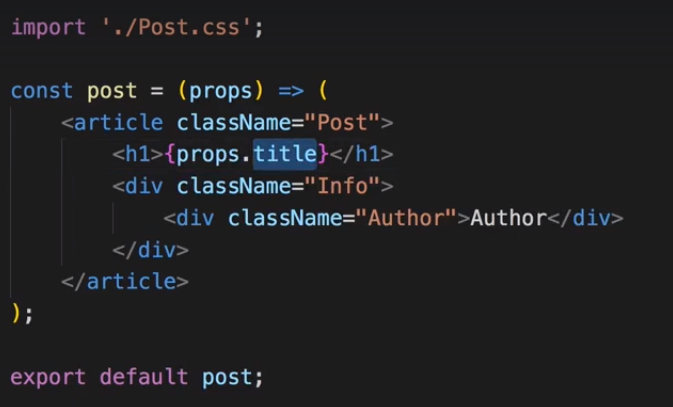
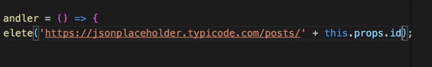
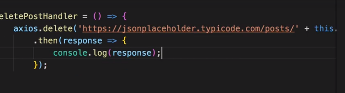
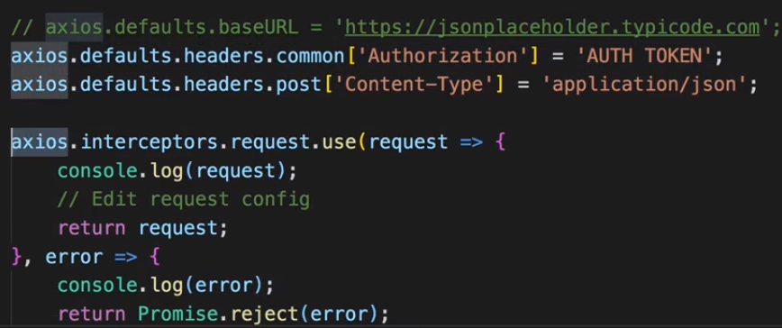

# Section-9 | Reaching Out To The Web
Note: We will only watch the lectures this time and not code anything in this section. We will keep coding for the Burger Project and other new projects In sha Allah.

## S9 | Module Introduction

The server will act as a RESTFUL server which will expose some endpoint for he UI end to interact.

## S9 | Understanding Our Project and Introducing Axios
### Project

### Json PlaceHolder

### Installing Axios
`npm install axios --save`

This library will be used to GET and POST data from and to the server.

## S9 | Creating HTTP Request To GET Data 

`ComponentDidMount()` is the best place to send HTTP request. Here we will also update the state which will trigger **re-render**.

## S9 | Rendering Fetched Data To The Screen

 

## S9 | Transforming Data

### Code
 
 

## S9 | Making A Post Selectable
 
 
 
 
 

[**07-Apr-2019**]

## S9 | Fetching Data on Update (without Creating Infinite Loops)
### Objective 
1. We want to fetch a post details when we click a post
2. We can send a http request inside the componentDidUpdate() lifecycle hook once we click a post and update the state
3. But this will create an infinite loop because updating the state inside componentDidUpdate() will trigger a re-render() recursively.
4. The solution is to conditionally update the state inside the conponentDidUpdate() method and check that the new prop.id is not same as the old post.id

### Code

## S9 | Posting Data To The Server

## S9 | Sending a Delete Request

## S9 | Handling Errors Locally

### Logging the Error 

 

### Doing More Than Just Logging The Error

Now you can render something different to the screen.

## S9 | Adding Interceptors to Execute Code Globally
### Objective 
1. Previously we handled http errors locally inside each components  
2. But now we want to handle http errors globally i.e. We want to do the same thing whenever/wherever/in whichever component http errors occur.
3. We can do this with the help of axios and interceptors
4. Interceptors are functions which are executed for every request leaving your app and every response returning into it.

### Code
* **We will include the interceptor inside the index.js which the most global file we have in out project**
  * 

* **This is the request which was sent through axios to get the post.**
  *   
  * But the posts did not load since we are blocking the request right now.
  * In you interceptor function you always need to return the request. Otherwise you are blocking the request.

* **You can also edit the request before returning it**
  * 

* **You can handle the error globally but also pass on the error so that local component can handle it within itself**
  * Handle error globally - like log the error to a log file
  * Local Component can hanle the error even if you handle it globally if you return a Promise.reject(error).
  * 

    * This error handler is for sending the request when there is internet connectivity or something and not for handling responses.
    * So you dont see the console log from the above error handler.
      * 

* **You can also add interceptor to handle responses.**
  * Just like **`request`** you need to have a **`response`** handler
    * 
  * Now we can see the error log from the global interceptor but also handle it locally.
    * 

* **Without error/typo in the request url the global interceptors log is seen and the data logged locally from component is also seen.**
  * 

## S9 | Removing Interceptors

## S9 | Setting a Default Global Configuration For Axios
### Objective 
* Set some default configuration/variables like url,authorization headers,etc which will be used to send request 
* Note that this will be used across **the Entire Application**

### Code
* Remove the url prefix from the axios.get method 

* In the `index.js` we can define the axios defaults which will be true for all request
  * 
    - Here we set the `baseURL`,`heades.common`,`headers.post` for all the request sent to the server.
  * The result of setting up headers as above
    * **For GET request**
      -  
    * **For POST request**
      - 

## S9 | Creating and using Axios Instances
### Objective
* In the above section we configured axios with default variables to be used acroos the **Entire Application**
* But what if you wanted to use **Different variables for Diffferent parts of the application** ?
* In such as case we can use a cool feature provided by Axios called `Instances`

### Code 
* **Create a file at the same level as App.js - called `axios.js`**
  * 
* Overrite the default config set up in the `index.js0` file inside `axios.js` as below:
  * 
* **Use the axios.js custom config file where you export the instance**
  * 
  * 

* **You will notice that you don't see the console logs set us in the global interceptors which executes for all the http request/response.**
    * 
    * This is because the interceptor was set up for the global axios instance which we are not using in the Blog.js container
    * 

* **You can also have interceptors for the instances just as the global axios object.**
  * 